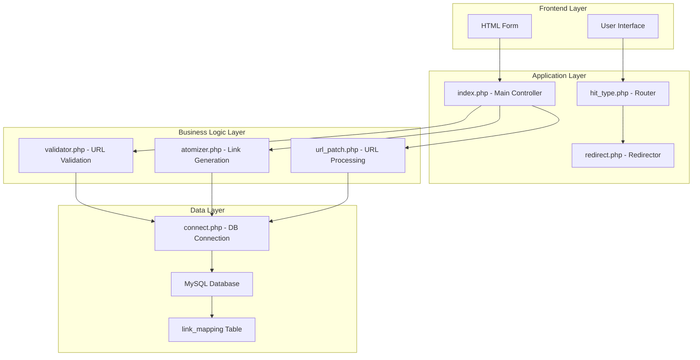
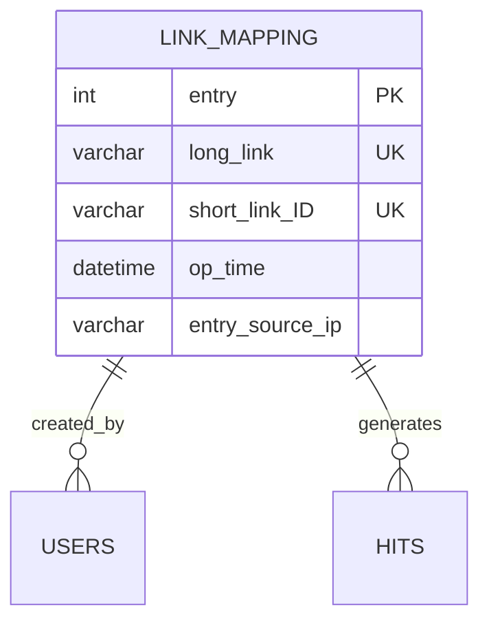
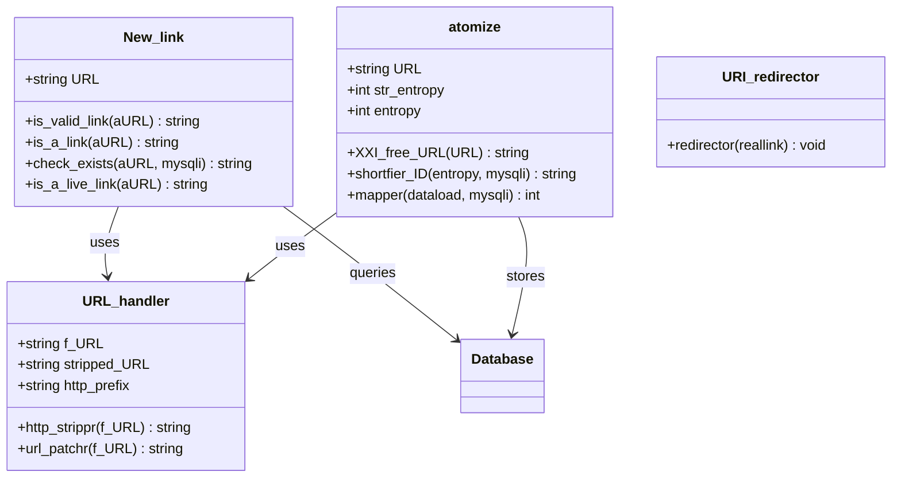

# Link Shortener - Technical Documentation

## Overview

This is a PHP-based URL shortener application that allows users to create shortened versions of long URLs. The application generates 6-character alphanumeric short codes and stores the mappings in a MySQL database.

## Architecture

The application follows a simple MVC-like pattern with the following components:

- **Frontend**: Simple HTML form for URL input
- **Backend**: PHP classes for URL processing, validation, and database operations
- **Database**: MySQL database storing URL mappings
- **Redirection**: Automatic redirect service for short links

## File Structure

```
link_shortener/
├── index.php              # Main entry point and UI
├── hit_type.php           # Short link processing and routing
├── redirect.php           # URL redirection handler
├── linksdb.sql           # Database schema
├── includes/
│   ├── connect.php       # Database connection
│   ├── validator.php     # URL validation logic
│   ├── atomizer.php      # Short link generation
│   └── url_patch.php     # URL formatting utilities
├── README.md
└── LICENSE
```

## Core Components

### 1. Main Application (`index.php`)

The main entry point that handles:
- User interface rendering
- Form submission processing
- URL validation orchestration
- Short link generation workflow

**Key Features:**
- Accepts long URLs via GET form submission
- Validates URL format and availability
- Generates unique 6-character short codes
- Displays success/error messages

### 2. Short Link Router (`hit_type.php`)

Processes incoming short link requests:
- Validates short code format (exactly 6 characters)
- Queries database for corresponding long URL
- Initiates redirection to original URL

### 3. URL Redirection (`redirect.php`)

**Class: `URI_redirector`**
- Handles HTTP/HTTPS protocol detection
- Performs actual redirect using HTTP headers
- Supports both secure and non-secure redirects

### 4. Database Connection (`includes/connect.php`)

Simple MySQL connection setup:
- Configures database credentials
- Creates mysqli connection object
- Used throughout the application

### 5. URL Validation (`includes/validator.php`)

**Class: `New_link`**

Comprehensive URL validation with multiple checks:

- `is_valid_link()`: Validates URL format and host extraction
- `is_a_link()`: Ensures single URL without spaces
- `check_exists()`: Prevents duplicate URL entries
- `is_a_live_link()`: Verifies URL accessibility via DNS resolution

### 6. Short Link Generation (`includes/atomizer.php`)

**Class: `atomize`**

Core functionality for link processing:

- `XXI_free_URL()`: Sanitizes URLs for database storage
- `shortfier_ID()`: Generates unique 6-character alphanumeric codes
- `mapper()`: Stores URL mappings in database

**Algorithm Details:**
- Character set: a-z, A-Z, 0-9 (62 possible characters)
- Length: 6 characters
- Total combinations: 62^6 = 56,800,235,584 possible short codes
- Collision detection ensures uniqueness

### 7. URL Processing (`includes/url_patch.php`)

**Class: `URL_handler`**

URL formatting utilities:

- `http_strippr()`: Removes HTTP/HTTPS prefixes
- `url_patchr()`: Adds appropriate HTTP prefixes

## Database Schema

### Table: `link_mapping`

```sql
CREATE TABLE `link_mapping` (
  `entry` int(100) NOT NULL AUTO_INCREMENT,
  `long_link` varchar(500) NOT NULL,
  `short_link_ID` varchar(6) NOT NULL,
  `op_time` datetime NOT NULL,
  `entry_source_ip` varchar(15) NOT NULL,
  PRIMARY KEY (`entry`),
  UNIQUE KEY `long_link` (`long_link`),
  UNIQUE KEY `short_link_id` (`short_link_ID`)
);
```

**Fields:**
- `entry`: Auto-incrementing primary key
- `long_link`: Original URL (max 500 characters)
- `short_link_ID`: 6-character short code
- `op_time`: Creation timestamp
- `entry_source_ip`: IP address of URL host

## Service Flow Diagrams

### 1. URL Shortening Process

```mermaid
graph TD
    A[User submits URL] --> B[index.php receives request]
    B --> C[Load validation classes]
    C --> D[New_link::is_valid_link()]
    D --> E{Valid format?}
    E -->|No| F[Return error message]
    E -->|Yes| G[New_link::is_a_link()]
    G --> H{Single URL?}
    H -->|No| I[Return 'bad URL' error]
    H -->|Yes| J[New_link::is_a_live_link()]
    J --> K{DNS resolvable?}
    K -->|No| L[Return 'link unreachable']
    K -->|Yes| M[New_link::check_exists()]
    M --> N{Already exists?}
    N -->|Yes| O[Return existing short link]
    N -->|No| P[atomize::XXI_free_URL()]
    P --> Q[atomize::shortfier_ID()]
    Q --> R[Generate 6-char code]
    R --> S[Check uniqueness in DB]
    S --> T{Unique?}
    T -->|No| R
    T -->|Yes| U[Get host IP]
    U --> V[atomize::mapper()]
    V --> W[Store in database]
    W --> X[Return success + short link]
```

### 2. Short Link Resolution Process

```mermaid
graph TD
    A[User visits short link] --> B[index.php receives request]
    B --> C{Query string length = 6?}
    C -->|No| D[Display error message]
    C -->|Yes| E[hit_type.php processes request]
    E --> F[Connect to database]
    F --> G[Query link_mapping table]
    G --> H{Short code found?}
    H -->|No| I[Display 'link does not exist']
    H -->|Yes| J[Extract long_link]
    J --> K[URI_redirector::redirector()]
    K --> L[Detect HTTP/HTTPS]
    L --> M[Send redirect header]
    M --> N[User redirected to original URL]
```

### 3. System Architecture Overview



### 4. Database Entity Relationship



### 5. Class Relationship Diagram



## Security Considerations

### Current Security Measures
1. **SQL Injection Prevention**: Uses `addslashes()` for basic sanitization
2. **XSS Protection**: URL filtering through `XXI_free_URL()`
3. **Input Validation**: Multiple validation layers for URLs
4. **Unique Constraints**: Database constraints prevent duplicate entries

### Security Vulnerabilities
1. **SQL Injection**: `addslashes()` is insufficient; should use prepared statements
2. **Open Redirect**: No validation of redirect destinations
3. **Rate Limiting**: No protection against abuse
4. **Input Sanitization**: Limited XSS protection

## Performance Characteristics

### Scalability Metrics
- **Short Code Space**: 56.8 billion possible combinations
- **Database Efficiency**: Indexed short codes for fast lookups
- **Memory Usage**: Minimal - stateless request processing

### Bottlenecks
1. **Database Queries**: Each request requires database lookup
2. **Collision Detection**: Potential performance impact with high usage
3. **DNS Resolution**: Live link validation adds latency

## Configuration

### Database Setup
1. Create MySQL database
2. Import `linksdb.sql` schema
3. Update `includes/connect.php` with credentials

### Deployment Requirements
- PHP 7.0+ with mysqli extension
- MySQL 5.7+ or MariaDB 10.2+
- Web server (Apache/Nginx)

## API Usage

### Creating Short Links
```
GET /index.php?URL=https://example.com&submit=Shortify+My+Link
```

### Accessing Short Links
```
GET /index.php?abc123
```

## Future Improvements

1. **Enhanced Security**: Implement prepared statements and CSRF protection
2. **Analytics**: Track click counts and user analytics
3. **Custom Codes**: Allow user-defined short codes
4. **Bulk Operations**: Support batch URL processing
5. **API Endpoints**: RESTful API for programmatic access
6. **Caching**: Implement Redis for frequently accessed links
7. **Rate Limiting**: Prevent abuse with request throttling

## Error Handling

The application provides user-friendly error messages for:
- Invalid URL formats
- Unreachable URLs
- Duplicate URL submissions
- Database connection failures
- Non-existent short codes

## Monitoring and Logging

Currently limited logging includes:
- Database operation timestamps
- Source IP tracking
- Basic error reporting

Recommended additions:
- Access logs
- Performance metrics
- Error tracking
- Usage analytics