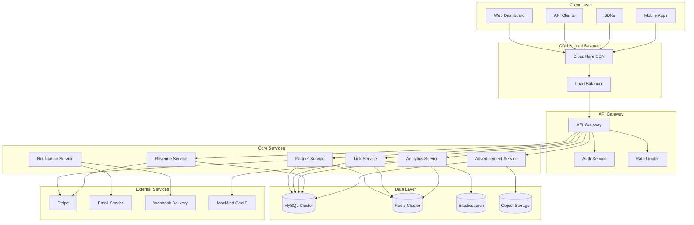
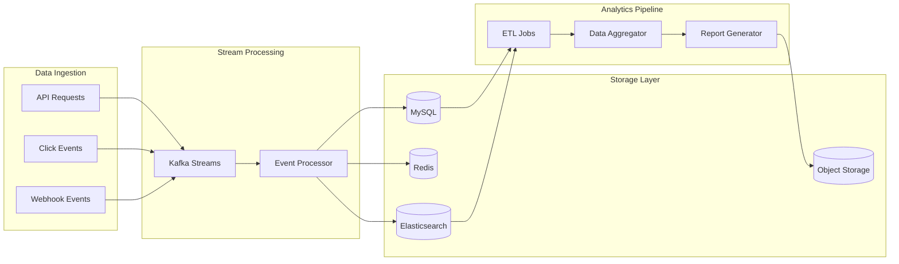

# Enhanced LinkShortener Architecture Documentation

## Table of Contents

1. [System Overview](#system-overview)
2. [Architecture Principles](#architecture-principles)
3. [System Components](#system-components)
4. [Data Architecture](#data-architecture)
5. [API Architecture](#api-architecture)
6. [Security Architecture](#security-architecture)
7. [Performance Architecture](#performance-architecture)
8. [Deployment Architecture](#deployment-architecture)
9. [Monitoring and Observability](#monitoring-and-observability)
10. [Scalability Considerations](#scalability-considerations)

## System Overview

The Enhanced LinkShortener is a comprehensive URL shortening platform with partner integration, revenue sharing, and advanced analytics capabilities. The system is designed as a modern, cloud-native application with microservices architecture principles.

### High-Level Architecture



## Architecture Principles

### 1. Microservices Architecture
- **Service Decomposition**: Each business capability is implemented as an independent service
- **Domain-Driven Design**: Services are organized around business domains
- **API-First**: All services expose well-defined APIs
- **Database per Service**: Each service manages its own data

### 2. Cloud-Native Design
- **Containerization**: All services run in Docker containers
- **Orchestration**: Kubernetes for container orchestration
- **Service Discovery**: Automatic service registration and discovery
- **Configuration Management**: External configuration management

### 3. Scalability and Performance
- **Horizontal Scaling**: Services can scale independently
- **Caching Strategy**: Multi-layer caching for performance
- **Asynchronous Processing**: Event-driven architecture for non-blocking operations
- **CDN Integration**: Global content delivery for static assets

### 4. Security by Design
- **Zero Trust Architecture**: No implicit trust between services
- **API Security**: OAuth 2.0, API keys, and rate limiting
- **Data Encryption**: Encryption at rest and in transit
- **Audit Logging**: Comprehensive audit trails

### 5. Observability
- **Distributed Tracing**: End-to-end request tracing
- **Metrics Collection**: Comprehensive metrics and monitoring
- **Centralized Logging**: Structured logging with correlation IDs
- **Health Checks**: Proactive health monitoring

## System Components

### 1. API Gateway

**Technology**: Kong or AWS API Gateway
**Responsibilities**:
- Request routing and load balancing
- Authentication and authorization
- Rate limiting and throttling
- Request/response transformation
- API versioning and documentation

```yaml
# Kong Configuration Example
services:
  - name: partner-service
    url: http://partner-service:8080
    routes:
      - name: partner-routes
        paths: ["/api/v1/partners"]
        methods: ["GET", "POST", "PUT", "DELETE"]
    plugins:
      - name: jwt
      - name: rate-limiting
        config:
          minute: 100
          hour: 1000
```

### 2. Partner Service

**Technology**: PHP 8.2 with Symfony Framework
**Responsibilities**:
- Partner registration and management
- Authentication and session management
- Profile and KYC management
- Subscription and billing integration
- API key management

**Key Components**:
```php
// Partner Service Architecture
namespace LinkShortener\PartnerService;

interface PartnerServiceInterface
{
    public function registerPartner(PartnerRegistrationRequest $request): Partner;
    public function authenticatePartner(LoginRequest $request): AuthenticationResult;
    public function updateProfile(string $partnerId, ProfileUpdateRequest $request): PartnerProfile;
    public function manageSubscription(string $partnerId, SubscriptionRequest $request): Subscription;
}

class PartnerService implements PartnerServiceInterface
{
    public function __construct(
        private PartnerRepository $partnerRepository,
        private AuthenticationService $authService,
        private SubscriptionService $subscriptionService,
        private EventDispatcher $eventDispatcher
    ) {}
    
    // Implementation details...
}
```

### 3. Link Service

**Technology**: PHP 8.2 with high-performance optimizations
**Responsibilities**:
- URL shortening and expansion
- Short code generation with partner identification
- Link management and metadata
- Bulk operations
- Link analytics integration

**Short Code Generation Strategy**:
```php
class PartnerAwareShortCodeGenerator
{
    public function generate(string $partnerId, int $length = 6): string
    {
        // Generate partner hash (0-999)
        $partnerHash = crc32($partnerId) % 1000;
        
        // Generate random URL ID
        $urlId = random_int(1, 1000000);
        
        // Encode with partner identification
        $encoded = base_convert(($urlId * 1000) + $partnerHash, 10, 36);
        
        // Pad to desired length
        return str_pad($encoded, $length, '0', STR_PAD_LEFT);
    }
    
    public function extractPartnerId(string $shortCode): ?string
    {
        $decoded = base_convert($shortCode, 36, 10);
        $partnerHash = $decoded % 1000;
        
        // Lookup partner by hash
        return $this->partnerHashRepository->findPartnerByHash($partnerHash);
    }
}
```

### 4. Analytics Service

**Technology**: PHP 8.2 with Elasticsearch integration
**Responsibilities**:
- Real-time click tracking
- Geographic and device analytics
- Revenue analytics
- Report generation
- Data aggregation and visualization

**Analytics Pipeline**:
```php
class AnalyticsEventProcessor
{
    public function processClickEvent(ClickEvent $event): void
    {
        // Store raw event
        $this->eventStore->store($event);
        
        // Update real-time counters
        $this->redisCounters->increment("clicks:{$event->partnerId}");
        $this->redisCounters->increment("clicks:total");
        
        // Enrich with geo data
        $geoData = $this->geoService->lookup($event->ipAddress);
        $event->setGeoData($geoData);
        
        // Index for search and analytics
        $this->elasticsearch->index('click-events', $event->toArray());
        
        // Trigger revenue calculation
        $this->eventDispatcher->dispatch(new RevenueCalculationEvent($event));
    }
}
```

### 5. Revenue Service

**Technology**: PHP 8.2 with Stripe integration
**Responsibilities**:
- Revenue calculation and tracking
- Partner payout management
- Advertisement revenue attribution
- Financial reporting
- Stripe integration for payouts

```php
class RevenueCalculationService
{
    public function calculateRevenue(ClickEvent $event): RevenueRecord
    {
        $advertisement = $this->getAdvertisementForClick($event);
        $partner = $this->partnerRepository->find($event->partnerId);
        
        // Calculate gross revenue (CPM basis)
        $grossRevenue = $advertisement->getCpmRate() / 1000;
        
        // Calculate partner share
        $partnerRevenue = $grossRevenue * $partner->getRevenueShare();
        $serviceRevenue = $grossRevenue - $partnerRevenue;
        
        return new RevenueRecord(
            partnerId: $event->partnerId,
            grossRevenue: $grossRevenue,
            partnerRevenue: $partnerRevenue,
            serviceRevenue: $serviceRevenue,
            clickEventId: $event->id
        );
    }
}
```

### 6. Advertisement Service

**Technology**: PHP 8.2 with Redis caching
**Responsibilities**:
- Advertisement management and targeting
- Ad selection algorithms
- Performance tracking
- Budget management
- Creative asset management

```php
class AdSelectionEngine
{
    public function selectAd(AdRequest $request): ?Advertisement
    {
        $criteria = new AdSelectionCriteria(
            country: $request->country,
            device: $request->device,
            partnerId: $request->partnerId
        );
        
        $eligibleAds = $this->adRepository->findEligible($criteria);
        
        if (empty($eligibleAds)) {
            return $this->getDefaultAd();
        }
        
        // Apply selection algorithm (weighted random, A/B testing, etc.)
        return $this->selectionAlgorithm->select($eligibleAds);
    }
}
```

## Data Architecture

### 1. Database Design

#### Primary Database (MySQL 8.0)
- **High Availability**: Master-slave replication with automatic failover
- **Performance**: Read replicas for analytics queries
- **Backup Strategy**: Daily full backups with point-in-time recovery
- **Monitoring**: Query performance monitoring and optimization

#### Caching Layer (Redis Cluster)
- **Session Storage**: Partner sessions and authentication tokens
- **Application Cache**: Frequently accessed data (URL mappings, partner info)
- **Real-time Counters**: Click counts and analytics counters
- **Rate Limiting**: API rate limit tracking

#### Search and Analytics (Elasticsearch)
- **Click Events**: Real-time indexing of click events
- **Analytics Queries**: Complex aggregations and filtering
- **Full-text Search**: Partner and link search functionality
- **Time-series Data**: Historical analytics data

### 2. Data Flow Architecture



### 3. Data Partitioning Strategy

#### Horizontal Partitioning (Sharding)
```sql
-- Partner-based sharding for analytics data
CREATE TABLE click_analytics_shard_1 (
    -- Partition for partners with hash 0-249
    id BIGINT UNSIGNED AUTO_INCREMENT PRIMARY KEY,
    partner_id VARCHAR(50) NOT NULL,
    -- ... other fields
    CONSTRAINT CHECK (CRC32(partner_id) % 1000 BETWEEN 0 AND 249)
);

CREATE TABLE click_analytics_shard_2 (
    -- Partition for partners with hash 250-499
    -- Similar structure with different hash range
);
```

#### Time-based Partitioning
```sql
-- Monthly partitions for click analytics
CREATE TABLE click_analytics (
    id BIGINT UNSIGNED AUTO_INCREMENT,
    clicked_at TIMESTAMP NOT NULL,
    -- ... other fields
    PRIMARY KEY (id, clicked_at)
) PARTITION BY RANGE (YEAR(clicked_at) * 100 + MONTH(clicked_at)) (
    PARTITION p202301 VALUES LESS THAN (202302),
    PARTITION p202302 VALUES LESS THAN (202303),
    -- ... additional partitions
);
```

## API Architecture

### 1. RESTful API Design

#### Resource-Based URLs
```
# Partner Resources
GET    /api/v1/partners/me
PUT    /api/v1/partners/me
GET    /api/v1/partners/me/profile
PUT    /api/v1/partners/me/profile

# Link Resources
POST   /api/v1/shorten
GET    /api/v1/links
GET    /api/v1/links/{shortCode}
PUT    /api/v1/links/{shortCode}
DELETE /api/v1/links/{shortCode}

# Analytics Resources
GET    /api/v1/analytics
GET    /api/v1/analytics/links/{shortCode}
GET    /api/v1/analytics/export
```

#### HTTP Status Codes
- `200 OK`: Successful GET, PUT requests
- `201 Created`: Successful POST requests
- `204 No Content`: Successful DELETE requests
- `400 Bad Request`: Invalid request data
- `401 Unauthorized`: Authentication required
- `403 Forbidden`: Insufficient permissions
- `404 Not Found`: Resource not found
- `429 Too Many Requests`: Rate limit exceeded
- `500 Internal Server Error`: Server error

### 2. API Versioning Strategy

#### URL Versioning
```php
// Route configuration
Route::prefix('api/v1')->group(function () {
    Route::resource('partners', PartnerController::class);
    Route::resource('links', LinkController::class);
});

Route::prefix('api/v2')->group(function () {
    // Future API version
});
```

#### Header-based Versioning (Alternative)
```http
GET /api/partners/me
Accept: application/vnd.linkshortener.v1+json
```

### 3. API Response Format

#### Standard Response Structure
```json
{
  "data": {
    // Response payload
  },
  "meta": {
    "timestamp": "2023-01-01T00:00:00Z",
    "version": "1.0.0",
    "request_id": "req_1234567890"
  },
  "pagination": {
    "current_page": 1,
    "per_page": 50,
    "total": 150,
    "total_pages": 3
  }
}
```

#### Error Response Structure
```json
{
  "error": {
    "code": "VALIDATION_ERROR",
    "message": "The request data is invalid",
    "details": [
      {
        "field": "email",
        "message": "Email is required"
      }
    ]
  },
  "meta": {
    "timestamp": "2023-01-01T00:00:00Z",
    "request_id": "req_1234567890"
  }
}
```

## Security Architecture

### 1. Authentication and Authorization

#### OAuth 2.0 Implementation
```php
class OAuthServer
{
    public function generateAccessToken(Partner $partner, array $scopes): AccessToken
    {
        $payload = [
            'sub' => $partner->getId(),
            'iat' => time(),
            'exp' => time() + 3600, // 1 hour
            'scopes' => $scopes,
            'jti' => Uuid::uuid4()->toString()
        ];
        
        return JWT::encode($payload, $this->privateKey, 'RS256');
    }
    
    public function validateToken(string $token): TokenValidationResult
    {
        try {
            $payload = JWT::decode($token, $this->publicKey, ['RS256']);
            
            // Check if token is revoked
            if ($this->tokenBlacklist->isBlacklisted($payload->jti)) {
                throw new InvalidTokenException('Token has been revoked');
            }
            
            return new TokenValidationResult(true, $payload);
        } catch (Exception $e) {
            return new TokenValidationResult(false, null, $e->getMessage());
        }
    }
}
```

#### API Key Management
```php
class ApiKeyService
{
    public function generateApiKey(Partner $partner): ApiKey
    {
        $key = 'ls_' . bin2hex(random_bytes(20));
        $secret = bin2hex(random_bytes(32));
        
        $apiKey = new ApiKey(
            key: $key,
            secret: $secret,
            partnerId: $partner->getId(),
            permissions: $this->getDefaultPermissions(),
            expiresAt: new DateTime('+1 year')
        );
        
        $this->apiKeyRepository->save($apiKey);
        
        return $apiKey;
    }
    
    public function validateApiKey(string $key): ?Partner
    {
        $apiKey = $this->apiKeyRepository->findByKey($key);
        
        if (!$apiKey || $apiKey->isExpired() || !$apiKey->isActive()) {
            return null;
        }
        
        // Update last used timestamp
        $apiKey->updateLastUsed();
        $this->apiKeyRepository->save($apiKey);
        
        return $this->partnerRepository->find($apiKey->getPartnerId());
    }
}
```

### 2. Rate Limiting

#### Redis-based Rate Limiting
```php
class RateLimiter
{
    public function checkLimit(string $key, int $limit, int $window): RateLimitResult
    {
        $current = $this->redis->incr($key);
        
        if ($current === 1) {
            $this->redis->expire($key, $window);
        }
        
        $ttl = $this->redis->ttl($key);
        
        return new RateLimitResult(
            allowed: $current <= $limit,
            limit: $limit,
            remaining: max(0, $limit - $current),
            resetTime: time() + $ttl
        );
    }
}
```

#### Sliding Window Rate Limiting
```php
class SlidingWindowRateLimiter
{
    public function checkLimit(string $key, int $limit, int $window): RateLimitResult
    {
        $now = time();
        $pipeline = $this->redis->pipeline();
        
        // Remove expired entries
        $pipeline->zremrangebyscore($key, '-inf', $now - $window);
        
        // Count current requests
        $pipeline->zcard($key);
        
        // Add current request
        $pipeline->zadd($key, $now, uniqid());
        
        // Set expiration
        $pipeline->expire($key, $window);
        
        $results = $pipeline->exec();
        $currentCount = $results[1];
        
        return new RateLimitResult(
            allowed: $currentCount < $limit,
            limit: $limit,
            remaining: max(0, $limit - $currentCount),
            resetTime: $now + $window
        );
    }
}
```

### 3. Data Security

#### Encryption at Rest
```php
class EncryptionService
{
    public function encrypt(string $data): string
    {
        $key = $this->getEncryptionKey();
        $iv = random_bytes(16);
        $encrypted = openssl_encrypt($data, 'AES-256-CBC', $key, 0, $iv);
        
        return base64_encode($iv . $encrypted);
    }
    
    public function decrypt(string $encryptedData): string
    {
        $data = base64_decode($encryptedData);
        $iv = substr($data, 0, 16);
        $encrypted = substr($data, 16);
        $key = $this->getEncryptionKey();
        
        return openssl_decrypt($encrypted, 'AES-256-CBC', $key, 0, $iv);
    }
}
```

#### SQL Injection Prevention
```php
class SecureRepository
{
    public function findPartnerByEmail(string $email): ?Partner
    {
        $stmt = $this->pdo->prepare(
            'SELECT * FROM partners WHERE email = ? AND status = ?'
        );
        $stmt->execute([$email, 'active']);
        
        $data = $stmt->fetch(PDO::FETCH_ASSOC);
        
        return $data ? $this->hydrate($data) : null;
    }
}
```

## Performance Architecture

### 1. Caching Strategy

#### Multi-Level Caching
```php
class CacheManager
{
    public function get(string $key): mixed
    {
        // L1: In-memory cache (APCu)
        $value = apcu_fetch($key);
        if ($value !== false) {
            return $value;
        }
        
        // L2: Redis cache
        $value = $this->redis->get($key);
        if ($value !== null) {
            apcu_store($key, $value, 300); // 5 minutes
            return $value;
        }
        
        // L3: Database
        return null;
    }
    
    public function set(string $key, mixed $value, int $ttl = 3600): void
    {
        // Store in both levels
        apcu_store($key, $value, min($ttl, 300));
        $this->redis->setex($key, $ttl, $value);
    }
}
```

#### Cache Invalidation Strategy
```php
class CacheInvalidationService
{
    public function invalidatePartnerCache(string $partnerId): void
    {
        $patterns = [
            "partner:{$partnerId}:*",
            "partner_links:{$partnerId}:*",
            "partner_analytics:{$partnerId}:*"
        ];
        
        foreach ($patterns as $pattern) {
            $keys = $this->redis->keys($pattern);
            if (!empty($keys)) {
                $this->redis->del($keys);
            }
        }
        
        // Invalidate CDN cache
        $this->cdnService->purge([
            "/api/v1/partners/{$partnerId}",
            "/api/v1/partners/{$partnerId}/analytics"
        ]);
    }
}
```

### 2. Database Optimization

#### Query Optimization
```sql
-- Optimized queries with proper indexing
-- Index on partner_id and created_at for analytics queries
CREATE INDEX idx_click_analytics_partner_date 
ON click_analytics (partner_id, clicked_at DESC);

-- Composite index for filtering and sorting
CREATE INDEX idx_shortened_urls_partner_status_created 
ON shortened_urls (partner_id, status, created_at DESC);

-- Covering index for common queries
CREATE INDEX idx_partners_email_status_covering 
ON partners (email, status) INCLUDE (id, company_name, api_key);
```

#### Connection Pooling
```php
class DatabaseConnectionPool
{
    private array $connections = [];
    private int $maxConnections = 20;
    
    public function getConnection(): PDO
    {
        if (count($this->connections) < $this->maxConnections) {
            $connection = $this->createConnection();
            $this->connections[] = $connection;
            return $connection;
        }
        
        // Return existing connection from pool
        return $this->connections[array_rand($this->connections)];
    }
    
    private function createConnection(): PDO
    {
        $dsn = "mysql:host={$this->host};dbname={$this->database};charset=utf8mb4";
        
        return new PDO($dsn, $this->username, $this->password, [
            PDO::ATTR_ERRMODE => PDO::ERRMODE_EXCEPTION,
            PDO::ATTR_DEFAULT_FETCH_MODE => PDO::FETCH_ASSOC,
            PDO::ATTR_PERSISTENT => true,
            PDO::MYSQL_ATTR_INIT_COMMAND => "SET NAMES utf8mb4 COLLATE utf8mb4_unicode_ci"
        ]);
    }
}
```

### 3. Asynchronous Processing

#### Message Queue Architecture
```php
class EventDispatcher
{
    public function dispatch(Event $event): void
    {
        // Immediate processing for critical events
        if ($event instanceof CriticalEvent) {
            $this->processImmediately($event);
            return;
        }
        
        // Queue for background processing
        $this->messageQueue->publish('events', [
            'type' => get_class($event),
            'payload' => $event->toArray(),
            'timestamp' => time(),
            'retry_count' => 0
        ]);
    }
    
    public function processEvent(array $message): void
    {
        try {
            $eventClass = $message['type'];
            $event = $eventClass::fromArray($message['payload']);
            
            $handler = $this->getHandler($eventClass);
            $handler->handle($event);
            
        } catch (Exception $e) {
            $this->handleFailedEvent($message, $e);
        }
    }
}
```

## Deployment Architecture

### 1. Containerization

#### Dockerfile Example
```dockerfile
FROM php:8.2-fpm-alpine

# Install system dependencies
RUN apk add --no-cache \
    nginx \
    supervisor \
    redis \
    mysql-client \
    curl \
    zip \
    unzip

# Install PHP extensions
RUN docker-php-ext-install \
    pdo_mysql \
    redis \
    opcache \
    bcmath

# Copy application code
COPY . /var/www/html
COPY docker/nginx.conf /etc/nginx/nginx.conf
COPY docker/supervisord.conf /etc/supervisor/conf.d/supervisord.conf

# Set permissions
RUN chown -R www-data:www-data /var/www/html

EXPOSE 80

CMD ["/usr/bin/supervisord", "-c", "/etc/supervisor/conf.d/supervisord.conf"]
```

#### Docker Compose for Development
```yaml
version: '3.8'

services:
  app:
    build: .
    ports:
      - "8080:80"
    environment:
      - DB_HOST=mysql
      - REDIS_HOST=redis
    depends_on:
      - mysql
      - redis
    volumes:
      - ./:/var/www/html

  mysql:
    image: mysql:8.0
    environment:
      MYSQL_ROOT_PASSWORD: password
      MYSQL_DATABASE: linkshortener_api
    ports:
      - "3306:3306"
    volumes:
      - mysql_data:/var/lib/mysql

  redis:
    image: redis:7-alpine
    ports:
      - "6379:6379"
    volumes:
      - redis_data:/data

  elasticsearch:
    image: elasticsearch:8.5.0
    environment:
      - discovery.type=single-node
      - xpack.security.enabled=false
    ports:
      - "9200:9200"
    volumes:
      - es_data:/usr/share/elasticsearch/data

volumes:
  mysql_data:
  redis_data:
  es_data:
```

### 2. Kubernetes Deployment

#### Deployment Configuration
```yaml
apiVersion: apps/v1
kind: Deployment
metadata:
  name: linkshortener-api
  labels:
    app: linkshortener-api
spec:
  replicas: 3
  selector:
    matchLabels:
      app: linkshortener-api
  template:
    metadata:
      labels:
        app: linkshortener-api
    spec:
      containers:
      - name: api
        image: linkshortener/api:latest
        ports:
        - containerPort: 80
        env:
        - name: DB_HOST
          valueFrom:
            secretKeyRef:
              name: database-secret
              key: host
        - name: DB_PASSWORD
          valueFrom:
            secretKeyRef:
              name: database-secret
              key: password
        resources:
          requests:
            memory: "256Mi"
            cpu: "250m"
          limits:
            memory: "512Mi"
            cpu: "500m"
        livenessProbe:
          httpGet:
            path: /health
            port: 80
          initialDelaySeconds: 30
          periodSeconds: 10
        readinessProbe:
          httpGet:
            path: /ready
            port: 80
          initialDelaySeconds: 5
          periodSeconds: 5
```

#### Service and Ingress
```yaml
apiVersion: v1
kind: Service
metadata:
  name: linkshortener-api-service
spec:
  selector:
    app: linkshortener-api
  ports:
  - protocol: TCP
    port: 80
    targetPort: 80
  type: ClusterIP

---
apiVersion: networking.k8s.io/v1
kind: Ingress
metadata:
  name: linkshortener-api-ingress
  annotations:
    kubernetes.io/ingress.class: nginx
    cert-manager.io/cluster-issuer: letsencrypt-prod
    nginx.ingress.kubernetes.io/rate-limit: "100"
spec:
  tls:
  - hosts:
    - api.linkshortener.com
    secretName: api-tls-secret
  rules:
  - host: api.linkshortener.com
    http:
      paths:
      - path: /
        pathType: Prefix
        backend:
          service:
            name: linkshortener-api-service
            port:
              number: 80
```

### 3. CI/CD Pipeline

#### GitHub Actions Workflow
```yaml
name: CI/CD Pipeline

on:
  push:
    branches: [main, develop]
  pull_request:
    branches: [main]

jobs:
  test:
    runs-on: ubuntu-latest
    
    services:
      mysql:
        image: mysql:8.0
        env:
          MYSQL_ROOT_PASSWORD: password
          MYSQL_DATABASE: linkshortener_test
        options: >-
          --health-cmd="mysqladmin ping"
          --health-interval=10s
          --health-timeout=5s
          --health-retries=3
      
      redis:
        image: redis:7-alpine
        options: >-
          --health-cmd="redis-cli ping"
          --health-interval=10s
          --health-timeout=5s
          --health-retries=3
    
    steps:
    - uses: actions/checkout@v3
    
    - name: Setup PHP
      uses: shivammathur/setup-php@v2
      with:
        php-version: '8.2'
        extensions: pdo_mysql, redis, bcmath
        tools: composer
    
    - name: Install dependencies
      run: composer install --prefer-dist --no-progress
    
    - name: Run tests
      run: |
        php artisan test
        php artisan test:coverage
    
    - name: Static analysis
      run: |
        vendor/bin/phpstan analyse
        vendor/bin/phpcs
  
  build:
    needs: test
    runs-on: ubuntu-latest
    if: github.ref == 'refs/heads/main'
    
    steps:
    - uses: actions/checkout@v3
    
    - name: Build Docker image
      run: |
        docker build -t linkshortener/api:${{ github.sha }} .
        docker tag linkshortener/api:${{ github.sha }} linkshortener/api:latest
    
    - name: Push to registry
      run: |
        echo ${{ secrets.DOCKER_PASSWORD }} | docker login -u ${{ secrets.DOCKER_USERNAME }} --password-stdin
        docker push linkshortener/api:${{ github.sha }}
        docker push linkshortener/api:latest
  
  deploy:
    needs: build
    runs-on: ubuntu-latest
    if: github.ref == 'refs/heads/main'
    
    steps:
    - name: Deploy to Kubernetes
      run: |
        kubectl set image deployment/linkshortener-api api=linkshortener/api:${{ github.sha }}
        kubectl rollout status deployment/linkshortener-api
```

## Monitoring and Observability

### 1. Application Metrics

#### Prometheus Metrics
```php
class MetricsCollector
{
    private PrometheusRegistry $registry;
    
    public function __construct()
    {
        $this->registry = new PrometheusRegistry();
        $this->initializeMetrics();
    }
    
    private function initializeMetrics(): void
    {
        // Request duration histogram
        $this->registry->getOrRegisterHistogram(
            'http_request_duration_seconds',
            'HTTP request duration in seconds',
            ['method', 'route', 'status_code']
        );
        
        // API request counter
        $this->registry->getOrRegisterCounter(
            'api_requests_total',
            'Total API requests',
            ['partner_id', 'endpoint', 'status']
        );
        
        // Link creation counter
        $this->registry->getOrRegisterCounter(
            'links_created_total',
            'Total links created',
            ['partner_id']
        );
        
        // Revenue gauge
        $this->registry->getOrRegisterGauge(
            'partner_revenue_total',
            'Total partner revenue',
            ['partner_id']
        );
    }
    
    public function recordApiRequest(string $partnerId, string $endpoint, int $statusCode, float $duration): void
    {
        $this->registry->getCounter('api_requests_total')
            ->inc(['partner_id' => $partnerId, 'endpoint' => $endpoint, 'status' => $statusCode]);
        
        $this->registry->getHistogram('http_request_duration_seconds')
            ->observe($duration, ['method' => 'POST', 'route' => $endpoint, 'status_code' => $statusCode]);
    }
}
```

### 2. Distributed Tracing

#### OpenTelemetry Integration
```php
class TracingService
{
    private TracerInterface $tracer;
    
    public function startSpan(string $name, array $attributes = []): SpanInterface
    {
        return $this->tracer->spanBuilder($name)
            ->setAttributes($attributes)
            ->startSpan();
    }
    
    public function traceApiRequest(Request $request, Closure $next): Response
    {
        $span = $this->startSpan('api.request', [
            'http.method' => $request->getMethod(),
            'http.url' => $request->getUri(),
            'partner.id' => $request->getAttribute('partner_id')
        ]);
        
        try {
            $response = $next($request);
            
            $span->setAttributes([
                'http.status_code' => $response->getStatusCode(),
                'response.size' => strlen($response->getBody())
            ]);
            
            return $response;
        } catch (Exception $e) {
            $span->recordException($e);
            $span->setStatus(StatusCode::STATUS_ERROR, $e->getMessage());
            throw $e;
        } finally {
            $span->end();
        }
    }
}
```

### 3. Logging Strategy

#### Structured Logging
```php
class StructuredLogger
{
    public function logApiRequest(Request $request, Response $response, float $duration): void
    {
        $this->logger->info('API request processed', [
            'request_id' => $request->getAttribute('request_id'),
            'partner_id' => $request->getAttribute('partner_id'),
            'method' => $request->getMethod(),
            'uri' => $request->getUri()->getPath(),
            'status_code' => $response->getStatusCode(),
            'duration_ms' => round($duration * 1000, 2),
            'user_agent' => $request->getHeaderLine('User-Agent'),
            'ip_address' => $request->getAttribute('ip_address'),
            'timestamp' => date('c')
        ]);
    }
    
    public function logSecurityEvent(string $event, array $context = []): void
    {
        $this->logger->warning('Security event', array_merge([
            'event_type' => $event,
            'timestamp' => date('c'),
            'severity' => 'high'
        ], $context));
    }
}
```

## Scalability Considerations

### 1. Horizontal Scaling

#### Auto-scaling Configuration
```yaml
apiVersion: autoscaling/v2
kind: HorizontalPodAutoscaler
metadata:
  name: linkshortener-api-hpa
spec:
  scaleTargetRef:
    apiVersion: apps/v1
    kind: Deployment
    name: linkshortener-api
  minReplicas: 3
  maxReplicas: 20
  metrics:
  - type: Resource
    resource:
      name: cpu
      target:
        type: Utilization
        averageUtilization: 70
  - type: Resource
    resource:
      name: memory
      target:
        type: Utilization
        averageUtilization: 80
  - type: Pods
    pods:
      metric:
        name: api_requests_per_second
      target:
        type: AverageValue
        averageValue: "100"
```

### 2. Database Scaling

#### Read Replicas
```php
class DatabaseManager
{
    private PDO $writeConnection;
    private array $readConnections;
    
    public function getReadConnection(): PDO
    {
        // Round-robin load balancing
        static $index = 0;
        $connection = $this->readConnections[$index % count($this->readConnections)];
        $index++;
        
        return $connection;
    }
    
    public function getWriteConnection(): PDO
    {
        return $this->writeConnection;
    }
}
```

#### Database Sharding
```php
class ShardManager
{
    public function getShardForPartner(string $partnerId): string
    {
        $hash = crc32($partnerId);
        $shardIndex = $hash % $this->shardCount;
        
        return "shard_{$shardIndex}";
    }
    
    public function getConnectionForShard(string $shard): PDO
    {
        return $this->connections[$shard] ?? throw new InvalidArgumentException("Unknown shard: {$shard}");
    }
}
```

### 3. Caching Optimization

#### Cache Warming Strategy
```php
class CacheWarmer
{
    public function warmPartnerCache(string $partnerId): void
    {
        // Pre-load frequently accessed data
        $partner = $this->partnerRepository->find($partnerId);
        $this->cache->set("partner:{$partnerId}", $partner, 3600);
        
        $recentLinks = $this->linkRepository->findRecentByPartner($partnerId, 100);
        $this->cache->set("partner_links:{$partnerId}:recent", $recentLinks, 1800);
        
        $analytics = $this->analyticsService->getPartnerSummary($partnerId);
        $this->cache->set("partner_analytics:{$partnerId}:summary", $analytics, 900);
    }
}
```

This comprehensive architecture documentation provides a complete technical overview of the Enhanced LinkShortener system, covering all aspects from high-level design to implementation details. The architecture is designed to be scalable, secure, and maintainable while providing excellent performance for partners and end-users.