# Improved Link Shortener - Architecture Documentation

## Overview

This document provides comprehensive technical documentation for the modernized Link Shortener v2.0, including detailed service flow diagrams, architecture patterns, and system interactions.

## System Architecture

### 1. High-Level Architecture

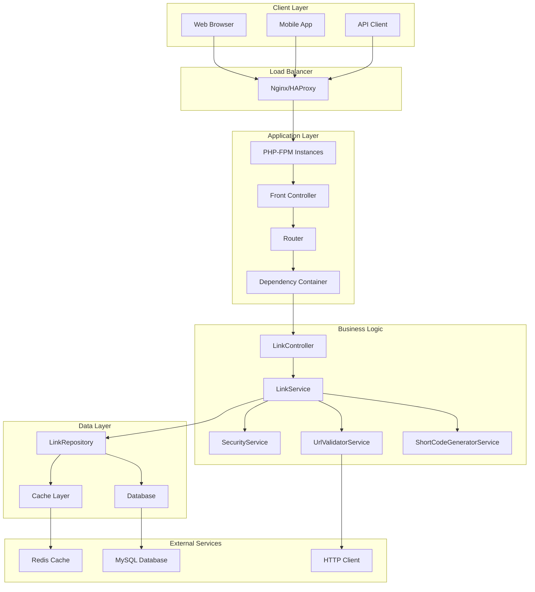

### 2. Service Layer Architecture

```mermaid
graph TD
    subgraph "Controller Layer"
        A[LinkController]
        A1[createLink]
        A2[resolveLink]
        A3[getUserLinks]
        A4[deleteLink]
        A5[getAnalytics]
        A6[getSystemStats]
        A7[getCSRFToken]
        
        A --> A1
        A --> A2
        A --> A3
        A --> A4
        A --> A5
        A --> A6
        A --> A7
    end
    
    subgraph "Service Layer"
        B[LinkService]
        C[SecurityService]
        D[UrlValidatorService]
        E[ShortCodeGeneratorService]
        
        B1[createShortLink]
        B2[resolveShortLink]
        B3[getUserLinks]
        B4[deleteLink]
        B5[getAnalytics]
        B6[cleanupExpiredLinks]
        
        C1[generateCSRFToken]
        C2[validateCSRFToken]
        C3[checkRateLimit]
        C4[sanitizeInput]
        C5[generateSecureHeaders]
        
        D1[validateUrl]
        D2[sanitizeUrl]
        D3[isReachable]
        D4[extractDomain]
        
        E1[generateUniqueShortCode]
        E2[generateCustomShortCode]
        E3[validateShortCode]
        E4[analyzeEntropy]
        
        B --> B1
        B --> B2
        B --> B3
        B --> B4
        B --> B5
        B --> B6
        
        C --> C1
        C --> C2
        C --> C3
        C --> C4
        C --> C5
        
        D --> D1
        D --> D2
        D --> D3
        D --> D4
        
        E --> E1
        E --> E2
        E --> E3
        E --> E4
    end
    
    subgraph "Repository Layer"
        F[LinkRepository]
        F1[save]
        F2[findByShortCode]
        F3[findByOriginalUrl]
        F4[findByCreatedBy]
        F5[incrementClickCount]
        F6[deleteByShortCode]
        F7[getStats]
        
        F --> F1
        F --> F2
        F --> F3
        F --> F4
        F --> F5
        F --> F6
        F --> F7
    end
    
    subgraph "Data Layer"
        G[Database]
        H[Cache]
        I[Configuration]
        
        G1[Links Table]
        G2[Click Analytics]
        G3[Users Table]
        G4[Security Events]
        
        H1[Redis Cache]
        H2[Link Cache]
        H3[Rate Limit Cache]
        H4[Validation Cache]
        
        G --> G1
        G --> G2
        G --> G3
        G --> G4
        
        H --> H1
        H --> H2
        H --> H3
        H --> H4
    end
    
    A1 --> B1
    A2 --> B2
    A3 --> B3
    A4 --> B4
    A5 --> B5
    A6 --> B6
    A7 --> C1
    
    B1 --> C3
    B1 --> C4
    B1 --> D1
    B1 --> E1
    B1 --> F1
    
    B2 --> E3
    B2 --> F2
    B2 --> F5
    
    B3 --> F4
    B4 --> F6
    B5 --> F2
    B6 --> F7
    
    F1 --> G1
    F2 --> H2
    F2 --> G1
    F3 --> G1
    F4 --> G1
    F5 --> G1
    F6 --> G1
    F7 --> G1
    
    C3 --> H3
    D3 --> H4
    E1 --> H2
```

## Service Flow Diagrams

### 1. Link Creation Flow

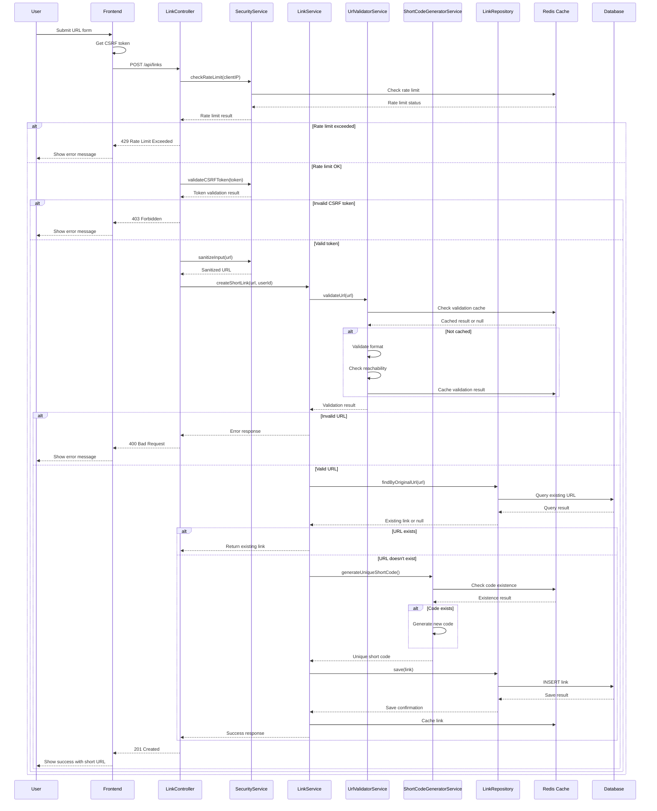

### 2. Link Resolution Flow

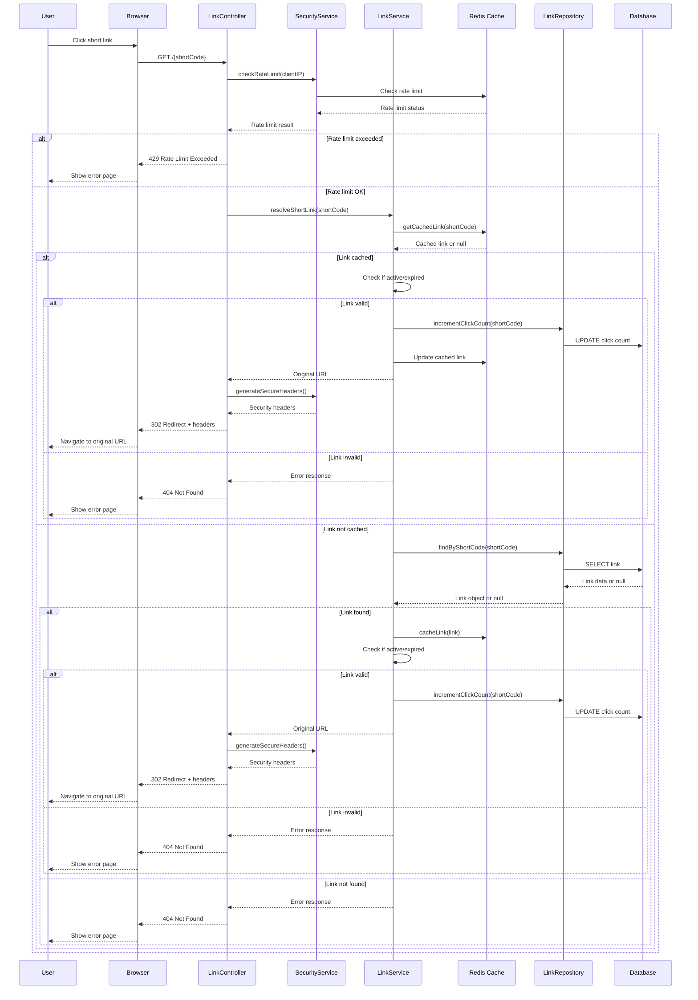

### 3. Security Flow

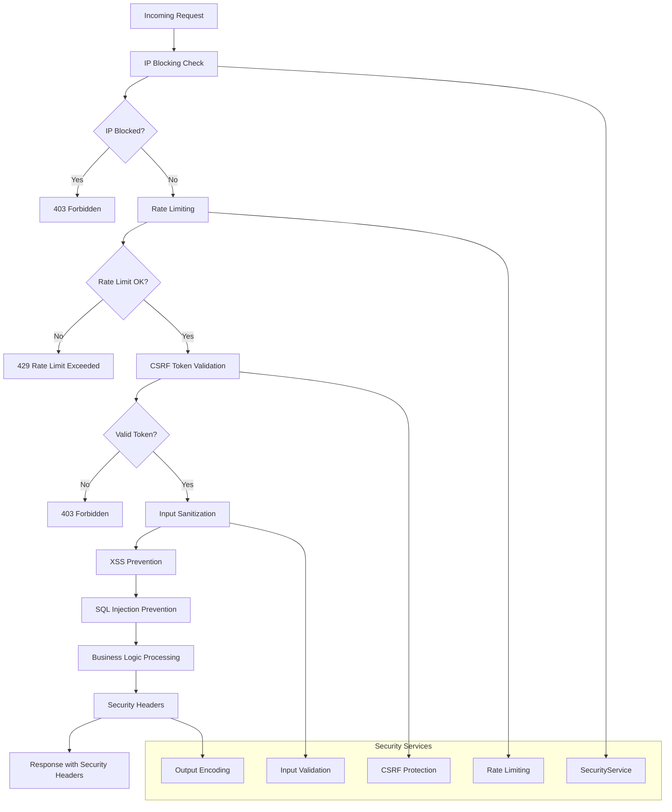

### 4. Caching Strategy

```mermaid
graph TD
    subgraph "Cache Layers"
        A[Application Cache]
        B[Database Query Cache]
        C[Validation Cache]
        D[Rate Limit Cache]
        E[Session Cache]
    end
    
    subgraph "Cache Operations"
        F[Read Through]
        G[Write Through]
        H[Cache Aside]
        I[Write Behind]
    end
    
    subgraph "Cache Keys"
        J[link:{shortCode}]
        K[url_reachable:{hash}]
        L[rate_limit:{action}:{ip}]
        M[short_code_exists:{code}]
        N[csrf_token:{token}]
    end
    
    subgraph "TTL Strategy"
        O[Links: 1 hour]
        P[Validation: 1 hour]
        Q[Rate Limits: Window duration]
        R[CSRF Tokens: 1 hour]
        S[Short Code Check: 1 hour]
    end
    
    A --> F
    A --> G
    B --> H
    C --> I
    
    F --> J
    G --> K
    H --> L
    I --> M
    
    J --> O
    K --> P
    L --> Q
    M --> R
    N --> S
```

### 5. Database Schema Relationships

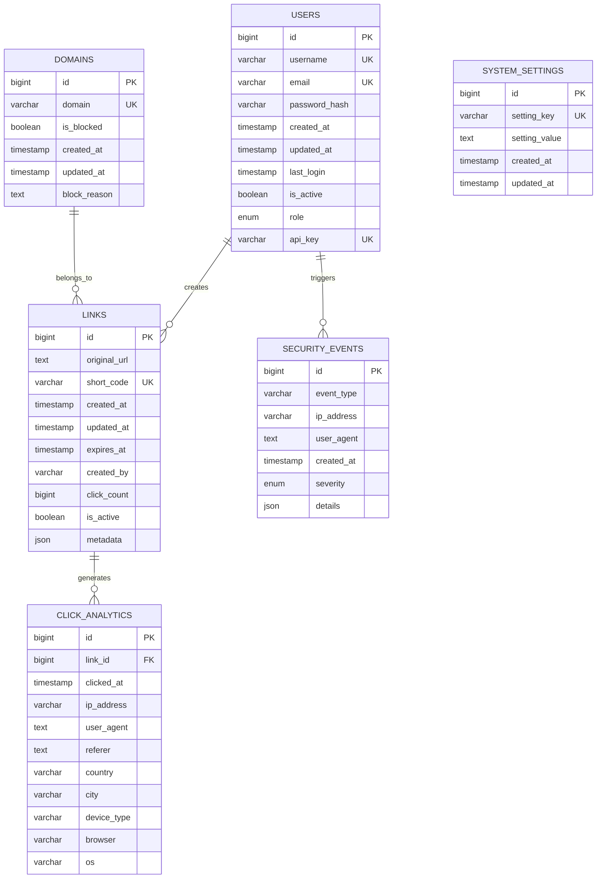

### 6. API Request/Response Flow

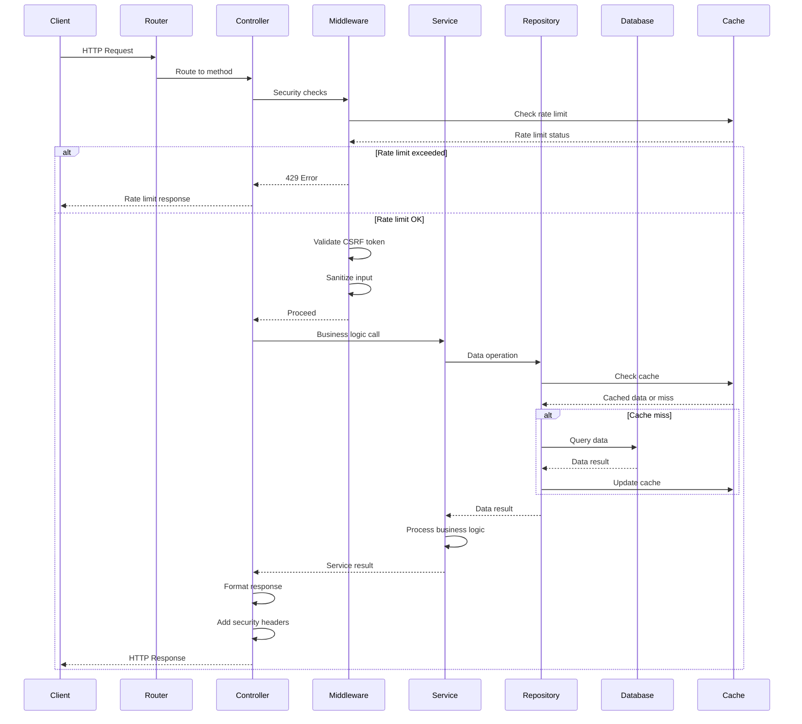

### 7. Error Handling Flow

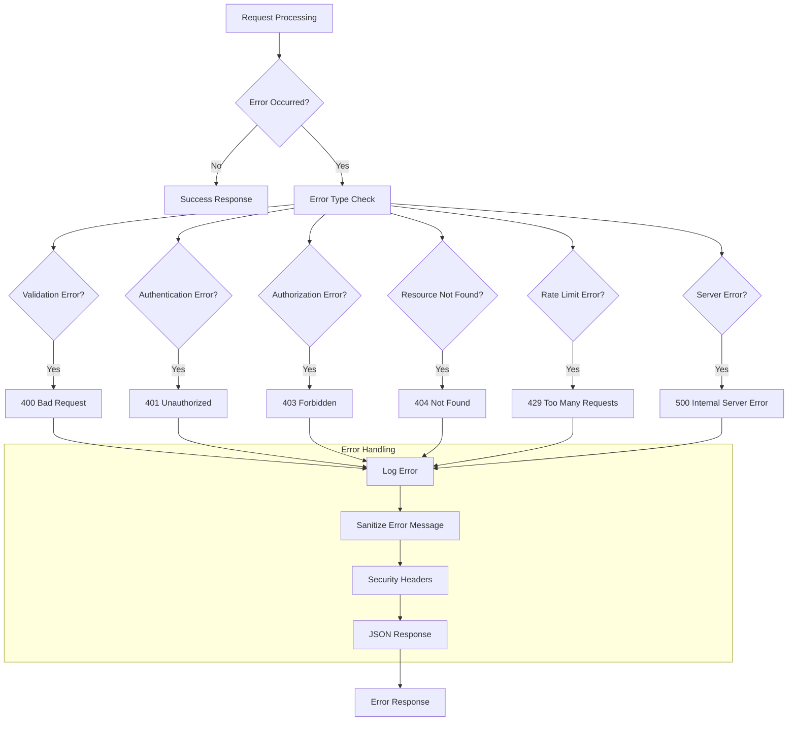

### 8. Performance Monitoring Flow

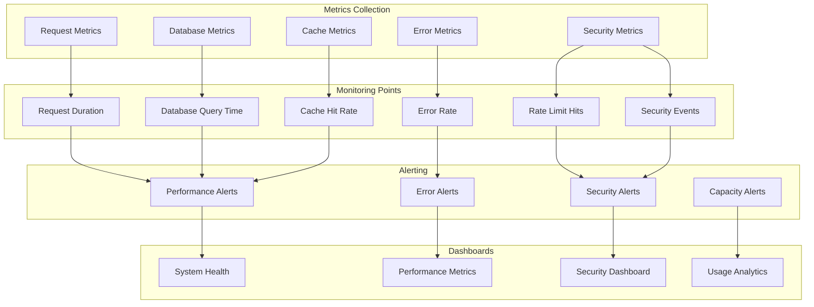

## Component Interactions

### 1. Dependency Injection Container

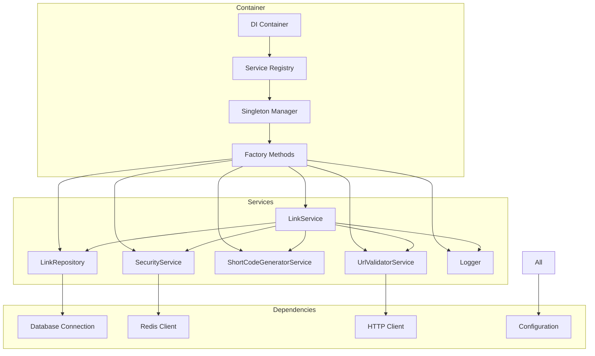

### 2. Configuration Management

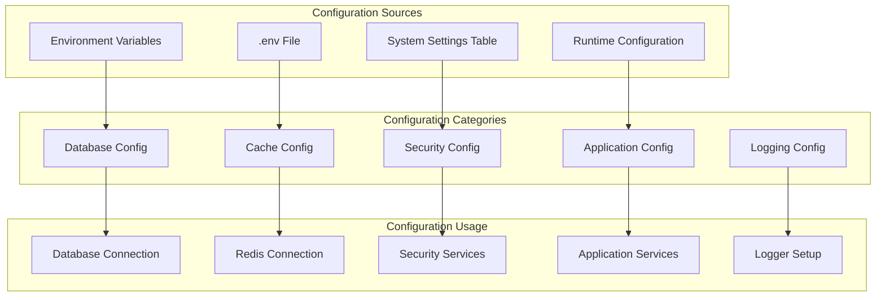

## Deployment Architecture

### 1. Production Deployment

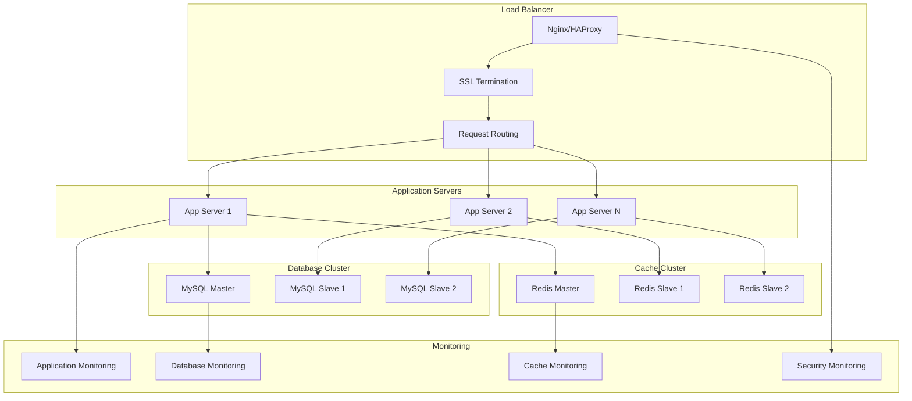

### 2. Scaling Strategy

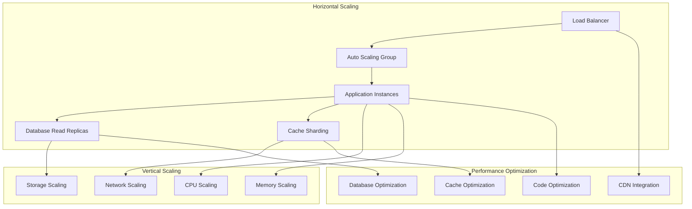

This comprehensive documentation provides detailed insights into the improved architecture, showing how the modern implementation addresses all the original limitations while providing a scalable, secure, and maintainable solution.