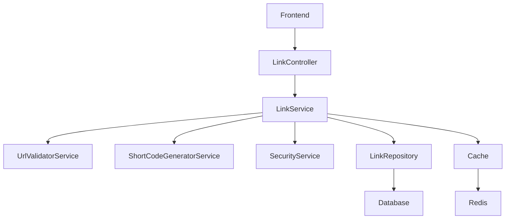

# Modern Link Shortener v2.0

A secure, scalable, and feature-rich URL shortener built with modern PHP practices and comprehensive security measures.

## 🚀 Features

### Core Functionality
- **URL Shortening**: Create short, memorable links from long URLs
- **Custom Short Codes**: Allow users to create custom short codes
- **Link Expiration**: Set expiration dates for temporary links
- **Click Tracking**: Track clicks and generate analytics
- **Link Management**: View, edit, and delete created links

### Security Features
- **CSRF Protection**: JWT-based CSRF tokens
- **Rate Limiting**: Prevent abuse with configurable rate limits
- **Input Sanitization**: Comprehensive input validation and sanitization
- **SQL Injection Prevention**: Prepared statements throughout
- **XSS Protection**: Output encoding and CSP headers
- **IP Blocking**: Automatic blocking of suspicious IPs
- **Security Headers**: Comprehensive security headers

### Performance Features
- **Redis Caching**: Fast link resolution with Redis cache
- **Database Optimization**: Proper indexing and query optimization
- **Connection Pooling**: Efficient database connections
- **Async Operations**: Non-blocking click count updates

### Modern Architecture
- **PSR-4 Autoloading**: Modern PHP namespace structure
- **Dependency Injection**: Clean service architecture
- **Repository Pattern**: Separated data access layer
- **Service Layer**: Business logic separation
- **RESTful API**: Clean API endpoints
- **Comprehensive Logging**: Structured logging with Monolog

## 📋 Requirements

- PHP 8.0 or higher
- MySQL 8.0+ or MariaDB 10.4+
- Redis 6.0+
- Composer
- Web server (Apache/Nginx)

### PHP Extensions
- PDO
- Redis
- OpenSSL
- JSON
- cURL

## 🛠️ Installation

### 1. Clone the Repository
```bash
git clone <repository-url>
cd link-shortener
```

### 2. Install Dependencies
```bash
composer install
```

### 3. Environment Configuration
```bash
cp .env.example .env
```

Edit `.env` with your configuration:
```env
# Database Configuration
DB_HOST=localhost
DB_PORT=3306
DB_NAME=linkshortener
DB_USER=your_username
DB_PASS=your_password

# Redis Configuration
REDIS_HOST=localhost
REDIS_PORT=6379
REDIS_PASSWORD=
REDIS_DB=0

# Application Configuration
APP_ENV=production
APP_DEBUG=false
APP_URL=https://yourdomain.com
APP_SECRET=your-secret-key-here

# Security
JWT_SECRET=your-jwt-secret-here
CSRF_TOKEN_LIFETIME=3600
RATE_LIMIT_REQUESTS=100
RATE_LIMIT_WINDOW=3600

# Cache Configuration
CACHE_DRIVER=redis
CACHE_TTL=3600

# Logging
LOG_LEVEL=info
LOG_FILE=logs/app.log

# Short Link Configuration
SHORT_CODE_LENGTH=6
SHORT_CODE_ALPHABET=abcdefghijklmnopqrstuvwxyzABCDEFGHIJKLMNOPQRSTUVWXYZ0123456789
```

### 4. Database Setup
```bash
mysql -u root -p < database/schema.sql
```

### 5. Web Server Configuration

#### Apache (.htaccess)
```apache
RewriteEngine On
RewriteCond %{REQUEST_FILENAME} !-f
RewriteCond %{REQUEST_FILENAME} !-d
RewriteRule ^(.*)$ index.php [QSA,L]
```

#### Nginx
```nginx
server {
    listen 80;
    server_name yourdomain.com;
    root /path/to/link-shortener/public;
    index index.php;

    location / {
        try_files $uri $uri/ /index.php?$query_string;
    }

    location ~ \.php$ {
        fastcgi_pass unix:/var/run/php/php8.0-fpm.sock;
        fastcgi_index index.php;
        fastcgi_param SCRIPT_FILENAME $realpath_root$fastcgi_script_name;
        include fastcgi_params;
    }

    location ~ /\.ht {
        deny all;
    }
}
```

### 6. Set Permissions
```bash
chmod -R 755 .
chmod -R 777 logs/
```

## 🔧 Configuration

### Environment Variables

| Variable | Description | Default |
|----------|-------------|---------|
| `DB_HOST` | Database host | localhost |
| `DB_PORT` | Database port | 3306 |
| `DB_NAME` | Database name | linkshortener |
| `DB_USER` | Database username | - |
| `DB_PASS` | Database password | - |
| `REDIS_HOST` | Redis host | localhost |
| `REDIS_PORT` | Redis port | 6379 |
| `APP_URL` | Application URL | http://localhost |
| `JWT_SECRET` | JWT secret key | - |
| `RATE_LIMIT_REQUESTS` | Rate limit requests | 100 |
| `RATE_LIMIT_WINDOW` | Rate limit window (seconds) | 3600 |
| `SHORT_CODE_LENGTH` | Short code length | 6 |

### Security Configuration

#### Rate Limiting
Configure rate limiting per IP address:
```env
RATE_LIMIT_REQUESTS=100  # Requests per window
RATE_LIMIT_WINDOW=3600   # Window in seconds (1 hour)
```

#### CSRF Protection
CSRF tokens are automatically generated and validated:
```env
CSRF_TOKEN_LIFETIME=3600  # Token lifetime in seconds
```

#### Short Code Configuration
Customize short code generation:
```env
SHORT_CODE_LENGTH=6
SHORT_CODE_ALPHABET=abcdefghijklmnopqrstuvwxyzABCDEFGHIJKLMNOPQRSTUVWXYZ0123456789
```

## 🔌 API Endpoints

### Authentication
All API endpoints use CSRF tokens for security. Get a token first:

```bash
GET /api/csrf-token
```

### Create Short Link
```bash
POST /api/links
Content-Type: application/json

{
    "url": "https://example.com",
    "custom_code": "optional-custom-code",
    "expires_at": "2024-12-31 23:59:59",
    "csrf_token": "your-csrf-token"
}
```

### Get User Links
```bash
GET /api/links?page=1&limit=20
```

### Get Link Analytics
```bash
GET /api/links/{shortCode}
```

### Delete Link
```bash
DELETE /api/links/{shortCode}
```

### System Statistics
```bash
GET /api/stats
```

### Health Check
```bash
GET /health
```

## 🏗️ Architecture

### Directory Structure
```
link-shortener/
├── public/
│   ├── index.php          # Front controller
│   └── app.html           # Frontend application
├── src/
│   ├── Config/            # Configuration classes
│   ├── Controllers/       # HTTP controllers
│   ├── Models/            # Data models
│   ├── Repositories/      # Data access layer
│   └── Services/          # Business logic
├── database/
│   └── schema.sql         # Database schema
├── logs/                  # Application logs
├── tests/                 # Unit tests
├── composer.json          # Dependencies
└── .env.example           # Environment template
```

### Service Architecture



### Security Layers

1. **Input Validation**: All inputs are validated and sanitized
2. **CSRF Protection**: JWT-based CSRF tokens
3. **Rate Limiting**: Redis-based rate limiting
4. **SQL Injection Prevention**: Prepared statements only
5. **XSS Protection**: Output encoding and CSP headers
6. **Security Headers**: Comprehensive security headers
7. **IP Blocking**: Automatic suspicious IP blocking

## 📊 Monitoring

### Logging
Structured logging with different levels:
- **DEBUG**: Detailed debug information
- **INFO**: General information
- **WARNING**: Warning conditions
- **ERROR**: Error conditions
- **CRITICAL**: Critical conditions

### Health Checks
Monitor application health:
```bash
curl http://yourdomain.com/health
```

### Performance Metrics
- Database query performance
- Cache hit rates
- Response times
- Error rates

## 🔒 Security Best Practices

### Production Deployment
1. **Environment Variables**: Never commit sensitive data
2. **HTTPS Only**: Always use HTTPS in production
3. **Database Security**: Use dedicated database user with minimal permissions
4. **File Permissions**: Restrict file permissions appropriately
5. **Regular Updates**: Keep dependencies updated
6. **Monitoring**: Monitor for suspicious activity

### Security Headers
The application automatically sets security headers:
- `X-Content-Type-Options: nosniff`
- `X-Frame-Options: DENY`
- `X-XSS-Protection: 1; mode=block`
- `Strict-Transport-Security`
- `Content-Security-Policy`
- `Referrer-Policy`

## 🚀 Performance Optimization

### Caching Strategy
- **Redis Cache**: Link resolution caching
- **Database Query Cache**: Expensive query caching
- **CDN**: Static asset delivery

### Database Optimization
- **Proper Indexing**: Optimized database indexes
- **Connection Pooling**: Efficient connection management
- **Query Optimization**: Optimized SQL queries

### Scalability
- **Horizontal Scaling**: Stateless architecture
- **Load Balancing**: Multiple application servers
- **Database Sharding**: For very high traffic

## 🧪 Testing

### Unit Tests
```bash
composer test
```

### Static Analysis
```bash
composer analyse
```

### Load Testing
Use tools like Apache Bench or Artillery for load testing:
```bash
ab -n 1000 -c 10 http://yourdomain.com/api/links
```

## 🔧 Maintenance

### Cleanup Expired Links
Run the cleanup procedure regularly:
```sql
CALL CleanupExpiredLinks();
```

### Log Rotation
Logs are automatically rotated. Configure log retention:
```env
LOG_LEVEL=info
LOG_FILE=logs/app.log
```

### Database Maintenance
Regular maintenance tasks:
```sql
OPTIMIZE TABLE links;
ANALYZE TABLE links;
```

## 🤝 Contributing

1. Fork the repository
2. Create a feature branch
3. Make your changes
4. Add tests
5. Submit a pull request

## 📄 License

This project is licensed under the MIT License - see the [LICENSE](LICENSE) file for details.

## 🆘 Support

For support, please:
1. Check the documentation
2. Search existing issues
3. Create a new issue with detailed information

## 🗺️ Roadmap

### Upcoming Features
- [ ] User authentication system
- [ ] Advanced analytics dashboard
- [ ] Bulk link operations
- [ ] QR code generation
- [ ] API rate limiting per user
- [ ] Link preview functionality
- [ ] Custom domains
- [ ] Link categories/tags
- [ ] Export functionality

### Performance Improvements
- [ ] Database sharding
- [ ] CDN integration
- [ ] Advanced caching strategies
- [ ] Background job processing

## 📈 Changelog

### v2.0.0
- Complete rewrite with modern PHP practices
- Added comprehensive security features
- Implemented caching with Redis
- Added rate limiting and CSRF protection
- Improved database schema with analytics
- Modern responsive frontend
- RESTful API architecture
- Comprehensive logging and monitoring

### v1.0.0
- Initial release
- Basic URL shortening functionality
- Simple PHP implementation
