# LinkShortener Service Flows Documentation

## Table of Contents

1. [Overview](#overview)
2. [Partner Onboarding Flow](#partner-onboarding-flow)
3. [Authentication Flows](#authentication-flows)
4. [Link Creation and Management Flow](#link-creation-and-management-flow)
5. [Revenue Generation Flow](#revenue-generation-flow)
6. [Advertisement Display Flow](#advertisement-display-flow)
7. [Analytics and Reporting Flow](#analytics-and-reporting-flow)
8. [Payment and Subscription Flow](#payment-and-subscription-flow)
9. [Real-time Integration Flow](#real-time-integration-flow)
10. [Error Handling and Recovery Flows](#error-handling-and-recovery-flows)

## Overview

This document outlines the key service flows for the LinkShortener API system, detailing how partners interact with the platform, how revenue is generated, and how the various components work together to provide a seamless experience.

## Partner Onboarding Flow

### 1. Registration Process

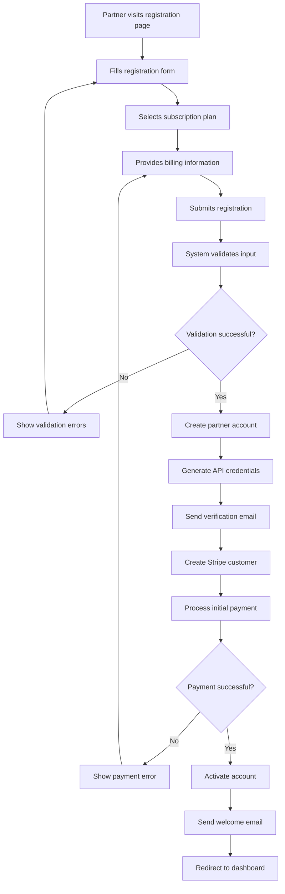

#### Step-by-Step Process

1. **Initial Registration**
   - Partner fills out company information
   - System validates email uniqueness
   - Password strength requirements enforced
   - Business type selection (individual/company/organization)

2. **Plan Selection**
   - Display available subscription plans
   - Show feature comparison
   - Calculate pricing (monthly vs yearly)
   - Apply any promotional discounts

3. **Payment Setup**
   - Collect billing address
   - Integrate with Stripe for payment processing
   - Support multiple payment methods
   - Handle payment failures gracefully

4. **Account Activation**
   - Generate unique partner ID
   - Create API key and secret
   - Set default revenue sharing (50%)
   - Initialize analytics tracking

5. **Email Verification**
   - Send verification email with secure token
   - Token expires in 24 hours
   - Resend functionality available
   - Account fully activated after verification

### 2. Onboarding Tutorial Flow

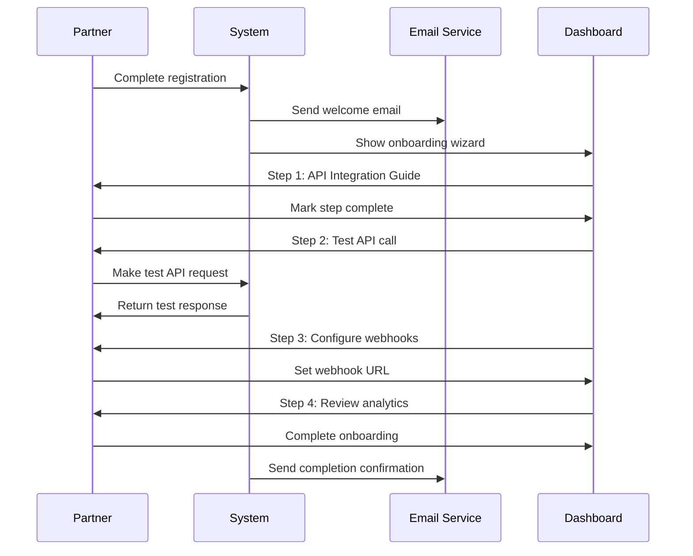

## Authentication Flows

### 1. API Key Authentication

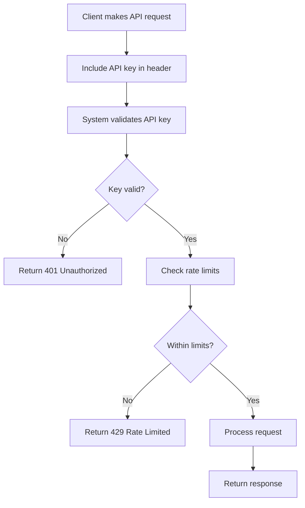

### 2. OAuth 2.0 Flow

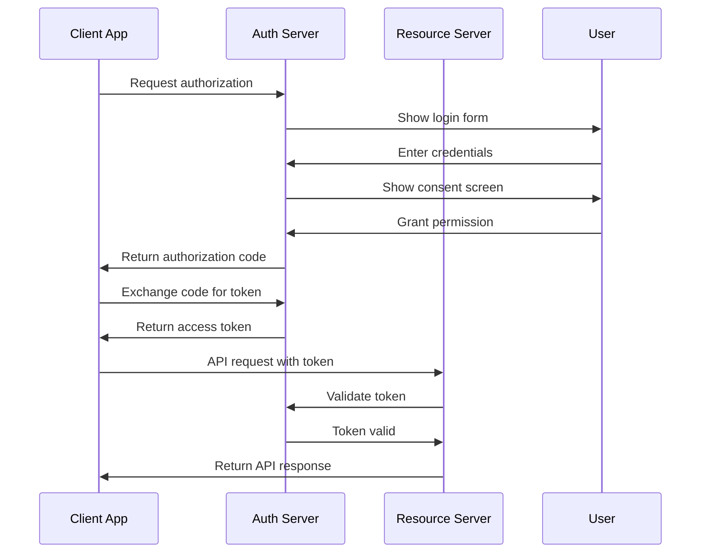

### 3. Multi-Factor Authentication Flow

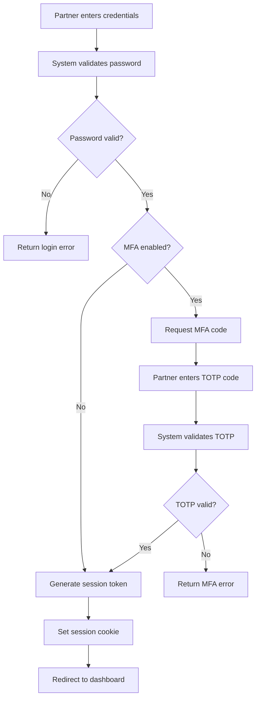

## Link Creation and Management Flow

### 1. Standard Link Creation

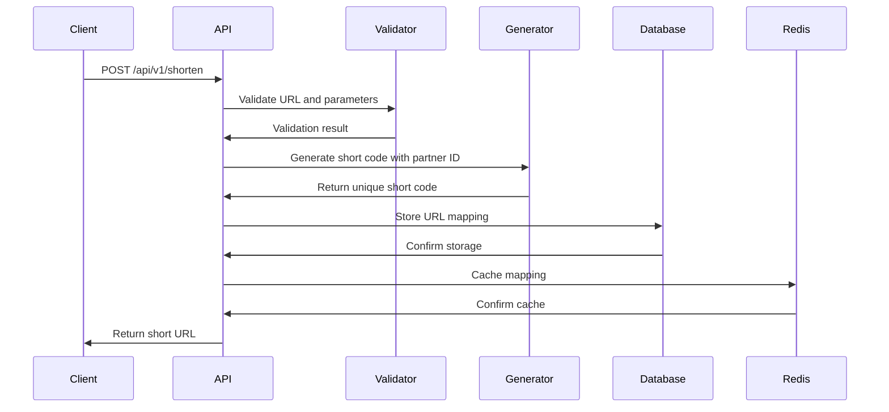

### 2. Partner-Identified Link Generation

```mermaid
graph TD
    A[Receive shorten request] --> B[Extract partner ID from API key]
    B --> C[Generate partner hash (0-999)]
    C --> D[Generate random URL ID]
    D --> E[Encode: (URL_ID * 1000) + partner_hash]
    E --> F[Convert to base36]
    F --> G[Pad to desired length]
    G --> H{Short code unique?}
    H -->|No| I[Increment attempt counter]
    I --> J{Max attempts reached?}
    J -->|Yes| K[Return error]
    J -->|No| D
    H -->|Yes| L[Store mapping in database]
    L --> M[Cache in Redis]
    M --> N[Return short URL]
```

### 3. Bulk Link Creation Flow

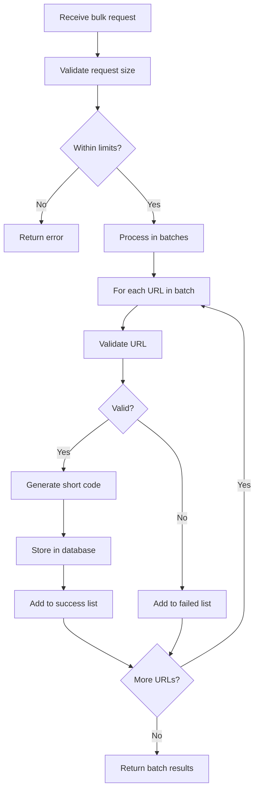

## Revenue Generation Flow

### 1. Click-to-Revenue Process

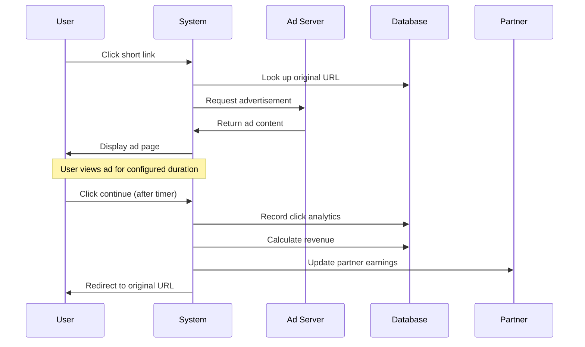

### 2. Revenue Calculation Flow

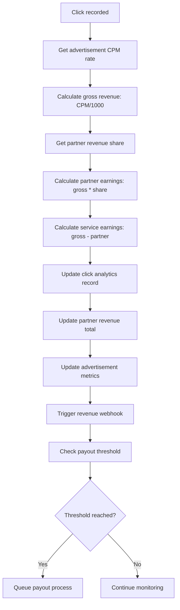

### 3. Monthly Revenue Reconciliation

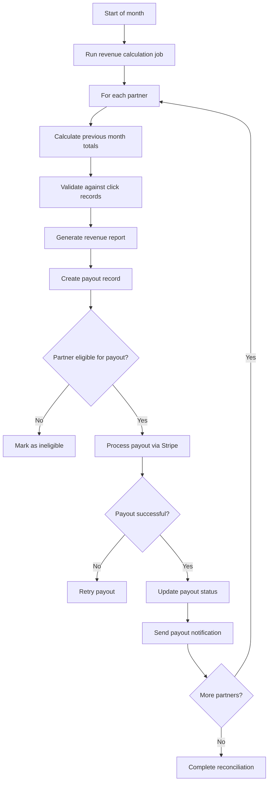

## Advertisement Display Flow

### 1. Ad Selection Process

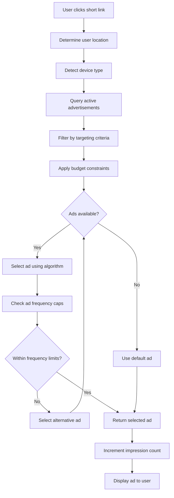

### 2. Ad Display and Interaction

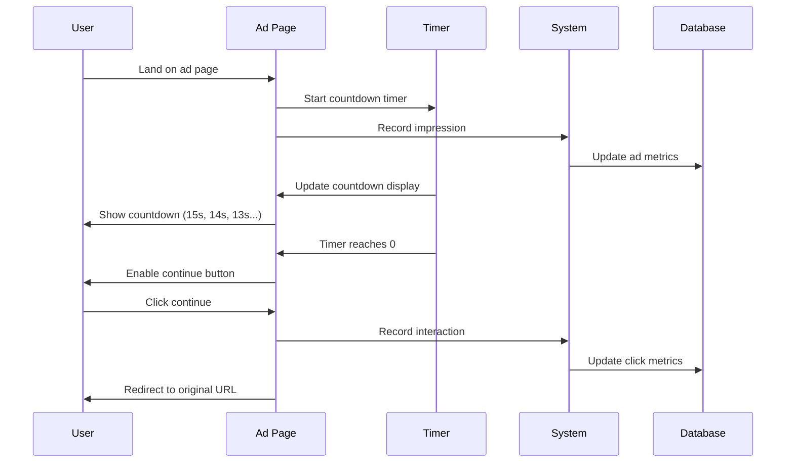

### 3. Ad Performance Tracking

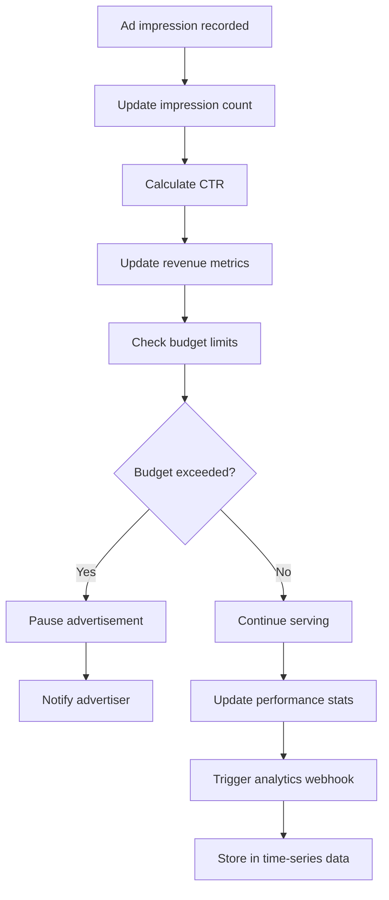

## Analytics and Reporting Flow

### 1. Real-time Analytics Collection

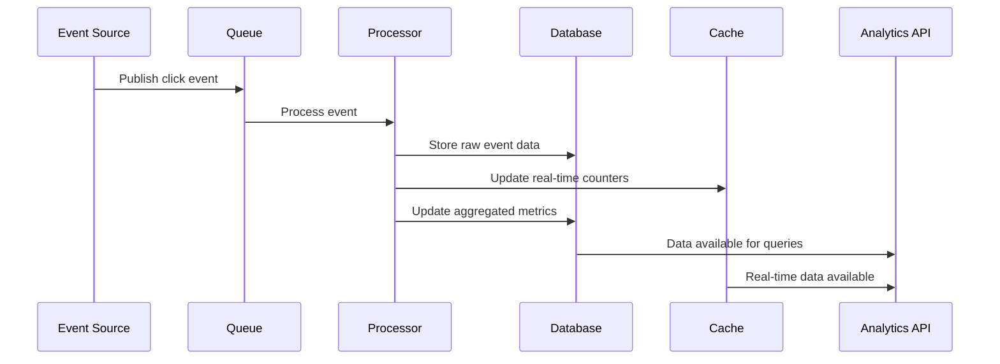

### 2. Analytics Dashboard Data Flow

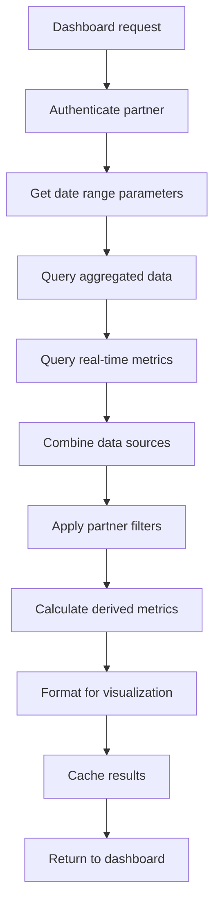

### 3. Report Generation Flow

```mermaid
graph TD
    A[Partner requests report] --> B[Validate parameters]
    B --> C[Queue report job]
    C --> D[Fetch data from multiple sources]
    D --> E[Process and aggregate]
    E --> F[Apply filters and grouping]
    F --> G[Generate charts/graphs]
    G --> H[Format output (PDF/CSV/Excel)]
    H --> I[Store report file]
    I --> J[Send download link]
    J --> K[Schedule cleanup]
```

## Payment and Subscription Flow

### 1. Subscription Creation

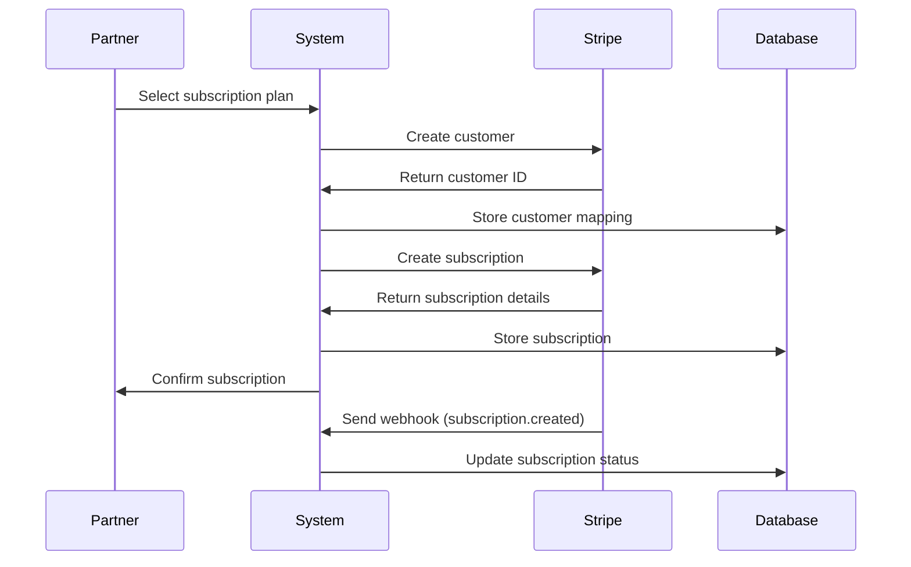

### 2. Payment Processing Flow

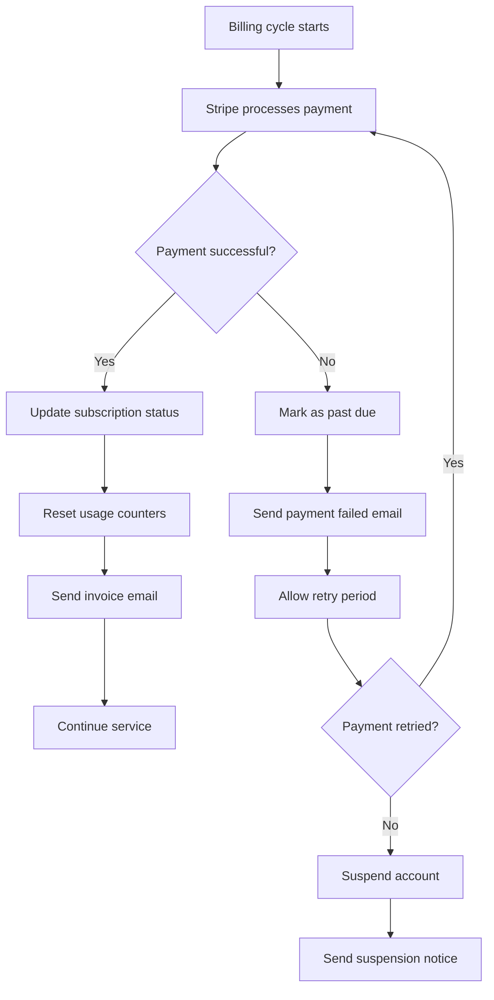

### 3. Plan Upgrade/Downgrade Flow

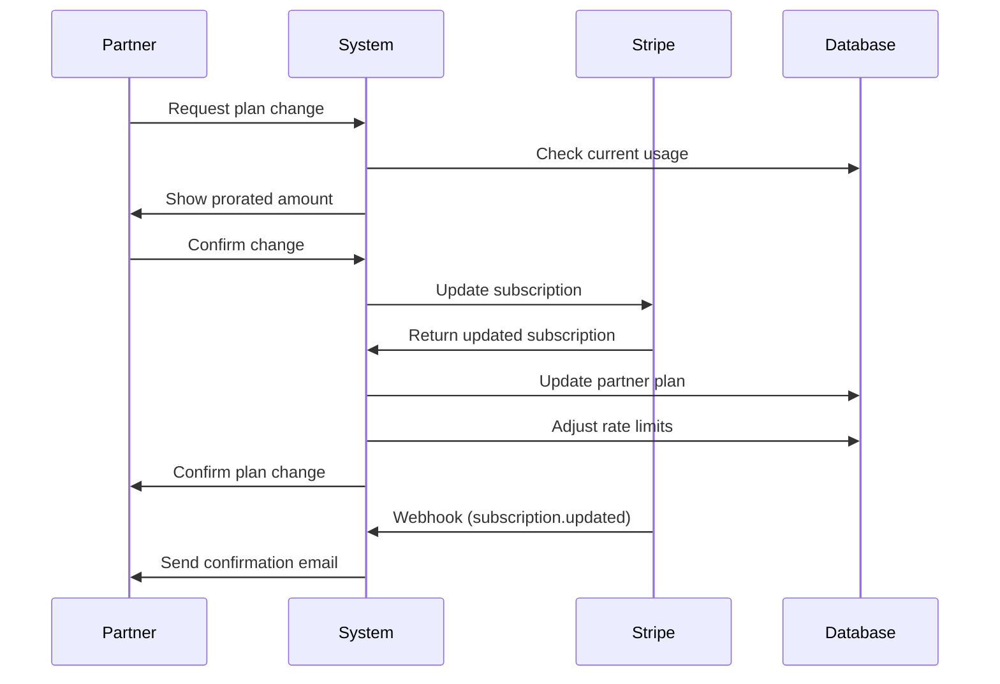

## Real-time Integration Flow

### 1. Chat Application Integration

```mermaid
sequenceDiagram
    participant U as User
    participant C as Chat App
    participant W as WebSocket
    participant A as API
    participant S as System
    
    U->>C: Type message with URL
    C->>A: Auto-detect URLs
    A->>S: Shorten detected URLs
    S->>A: Return short URLs
    A->>C: Replace URLs in message
    C->>W: Send processed message
    W->>C: Broadcast to recipients
    C->>U: Display message with short URLs
```

### 2. WebSocket Real-time Updates

```mermaid
graph TD
    A[Partner connects to WebSocket] --> B[Authenticate connection]
    B --> C[Subscribe to partner events]
    C --> D[Link clicked]
    D --> E[Generate event payload]
    E --> F[Send to WebSocket]
    F --> G[Partner receives update]
    G --> H[Update dashboard metrics]
    H --> I[Display notification]
```

### 3. SDK Integration Flow

```mermaid
sequenceDiagram
    participant A as App
    participant S as SDK
    participant C as Cache
    participant API as API Server
    
    A->>S: Initialize SDK with API key
    S->>API: Validate API key
    API->>S: Return validation result
    A->>S: Call shorten method
    S->>C: Check local cache
    C->>S: Cache miss
    S->>API: Make API request
    API->>S: Return short URL
    S->>C: Cache result
    S->>A: Return short URL
```

## Error Handling and Recovery Flows

### 1. API Error Handling

```mermaid
graph TD
    A[API request received] --> B[Validate request]
    B --> C{Valid?}
    C -->|No| D[Generate error response]
    C -->|Yes| E[Process request]
    E --> F{Processing successful?}
    F -->|No| G[Determine error type]
    F -->|Yes| H[Return success response]
    G --> I{Retryable error?}
    I -->|Yes| J[Add to retry queue]
    I -->|No| D
    J --> K[Wait for retry interval]
    K --> E
    D --> L[Log error]
    L --> M[Return error to client]
```

### 2. Database Failure Recovery

```mermaid
graph TD
    A[Database operation fails] --> B[Check connection status]
    B --> C{Connection alive?}
    C -->|No| D[Attempt reconnection]
    C -->|Yes| E[Retry operation]
    D --> F{Reconnection successful?}
    F -->|No| G[Switch to backup database]
    F -->|Yes| E
    E --> H{Retry successful?}
    H -->|Yes| I[Continue normal operation]
    H -->|No| J[Check retry count]
    J --> K{Max retries reached?}
    K -->|No| L[Wait and retry]
    K -->|Yes| M[Return error to client]
    L --> E
    G --> N[Update DNS/load balancer]
    N --> O[Continue with backup]
```

### 3. Payment Failure Recovery

```mermaid
sequenceDiagram
    participant S as System
    participant St as Stripe
    participant P as Partner
    participant E as Email Service
    
    St->>S: Payment failed webhook
    S->>S: Mark subscription as past_due
    S->>E: Send payment failed email
    E->>P: Receive email notification
    P->>S: Update payment method
    S->>St: Retry payment
    St->>S: Payment successful webhook
    S->>S: Reactivate subscription
    S->>E: Send payment success email
    E->>P: Receive confirmation
```

### 4. Rate Limit Handling

```mermaid
graph TD
    A[API request received] --> B[Check rate limit]
    B --> C{Within limits?}
    C -->|Yes| D[Process request]
    C -->|No| E[Return 429 status]
    E --> F[Include retry-after header]
    F --> G[Log rate limit violation]
    G --> H{Excessive violations?}
    H -->|Yes| I[Temporary IP ban]
    H -->|No| J[Continue monitoring]
    I --> K[Send abuse notification]
    K --> L[Review account status]
```

### 5. Service Degradation Flow

```mermaid
graph TD
    A[High system load detected] --> B[Enable degraded mode]
    B --> C[Disable non-essential features]
    C --> D[Increase cache TTL]
    D --> E[Reduce analytics granularity]
    E --> F[Queue non-critical operations]
    F --> G[Send system status update]
    G --> H[Monitor system metrics]
    H --> I{Load decreased?}
    I -->|No| J[Scale up resources]
    J --> H
    I -->|Yes| K[Gradually restore features]
    K --> L[Return to normal operation]
```

## Monitoring and Alerting Flows

### 1. Health Check Flow

```mermaid
graph TD
    A[Health check request] --> B[Check database connectivity]
    B --> C[Check Redis connectivity]
    C --> D[Check external APIs]
    D --> E[Check disk space]
    E --> F[Check memory usage]
    F --> G[Aggregate health status]
    G --> H{All systems healthy?}
    H -->|Yes| I[Return 200 OK]
    H -->|No| J[Return 503 Service Unavailable]
    J --> K[Include unhealthy components]
    K --> L[Trigger alerts]
```

### 2. Alert Escalation Flow

```mermaid
sequenceDiagram
    participant M as Monitor
    participant A as Alert System
    participant E as Email
    participant S as SMS
    participant P as PagerDuty
    
    M->>A: Threshold exceeded
    A->>E: Send email alert
    Note over A: Wait 5 minutes
    A->>A: Check if resolved
    A->>S: Send SMS alert
    Note over A: Wait 10 minutes
    A->>A: Check if resolved
    A->>P: Create incident
    P->>A: Acknowledge receipt
```

This comprehensive service flow documentation provides a complete picture of how the LinkShortener API system operates, from partner onboarding through revenue generation and error handling. Each flow is designed to be robust, scalable, and user-friendly while maintaining security and performance standards.