# Technical Analysis - Link Shortener Codebase

## Code Quality Assessment

### Strengths
1. **Clear Separation of Concerns**: Each class has distinct responsibilities
2. **Modular Design**: Components are well-separated into logical files
3. **Error Handling**: Basic error checking and user feedback
4. **Database Abstraction**: Consistent use of mysqli throughout

### Areas for Improvement
1. **Security**: Vulnerable to SQL injection and XSS attacks
2. **Code Style**: Inconsistent naming conventions and formatting
3. **Error Handling**: Limited exception handling and logging
4. **Performance**: No caching or optimization strategies

## Detailed Code Flow Analysis

### 1. Request Processing Flow

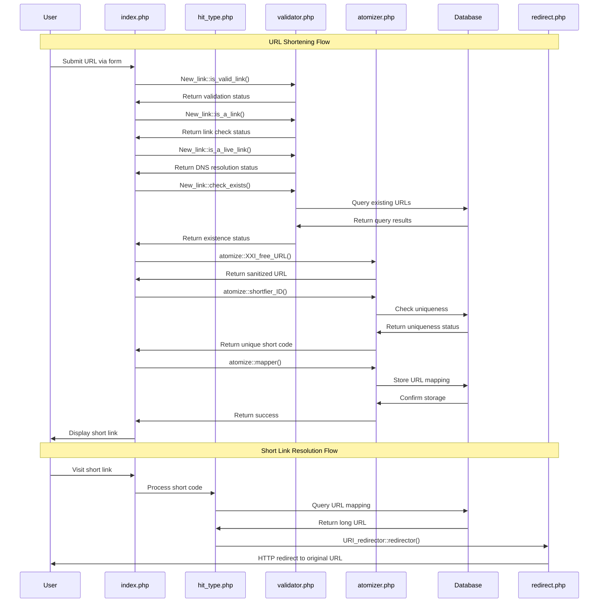

### 2. Database Interaction Patterns

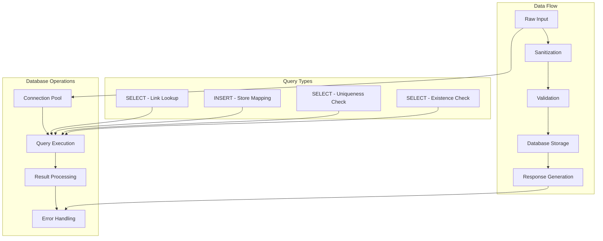

### 3. Validation Chain Process

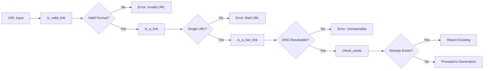

### 4. Short Code Generation Algorithm

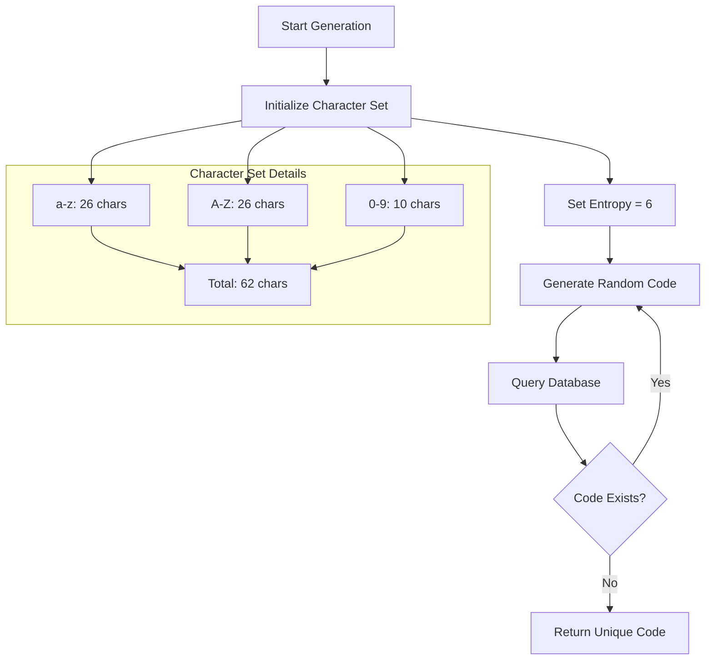

### 5. Error Handling Flow

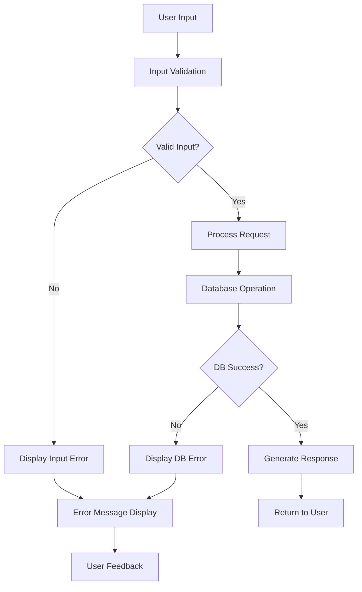

## Security Analysis

### Current Security Implementation

```mermaid
graph TD
    A[User Input] --> B[Basic Sanitization]
    B --> C[addslashes() Function]
    C --> D[Database Query]
    D --> E[Result Processing]
    
    subgraph "Security Gaps"
        F[No Prepared Statements]
        G[Limited XSS Protection]
        H[No CSRF Protection]
        I[No Rate Limiting]
    end
    
    C --> F
    B --> G
    A --> H
    A --> I
```

### Recommended Security Improvements

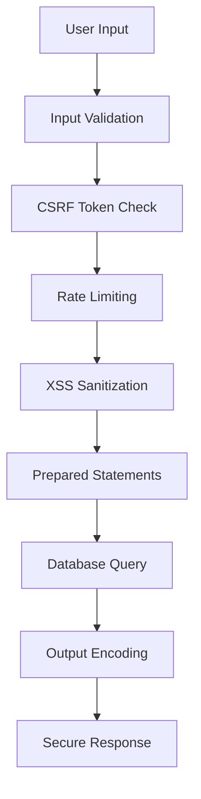

## Performance Analysis

### Current Performance Characteristics

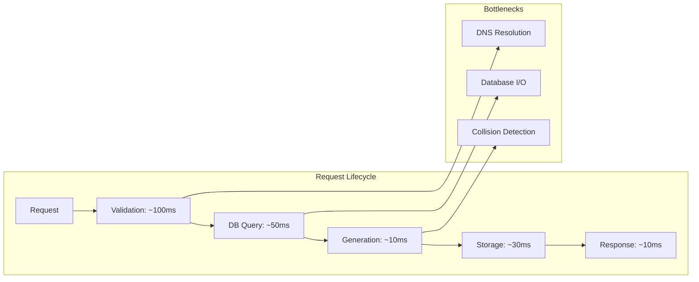

### Optimization Opportunities

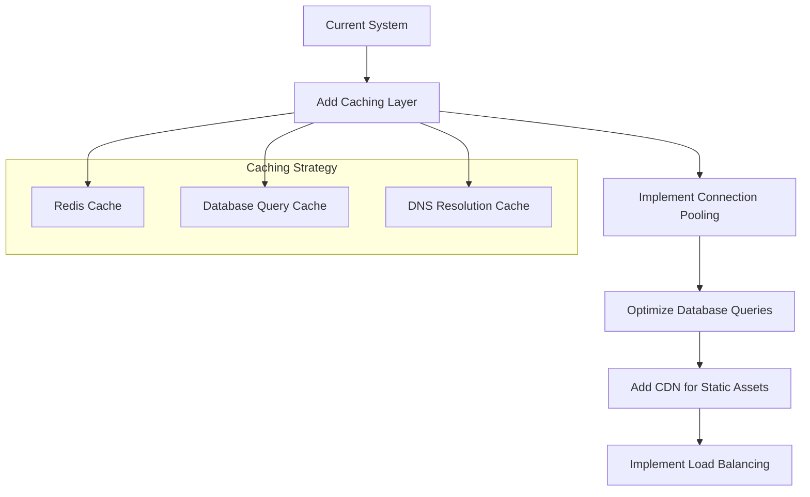

## Data Flow Architecture

### Complete System Data Flow

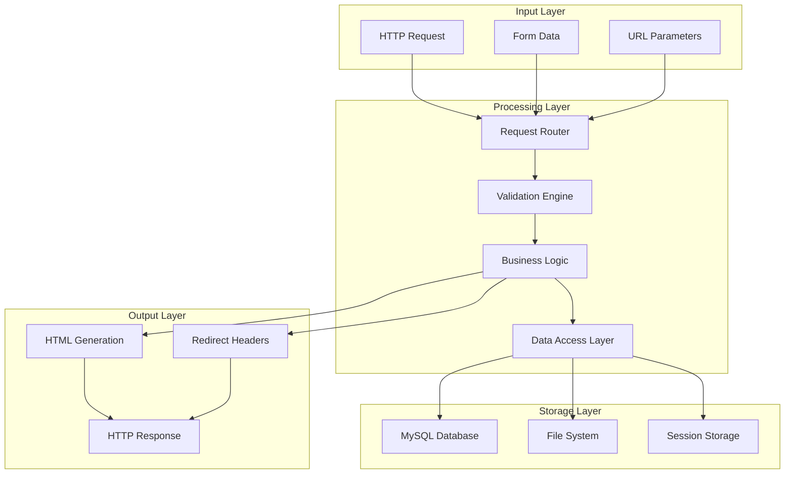

## Component Interaction Matrix

### Class Dependencies

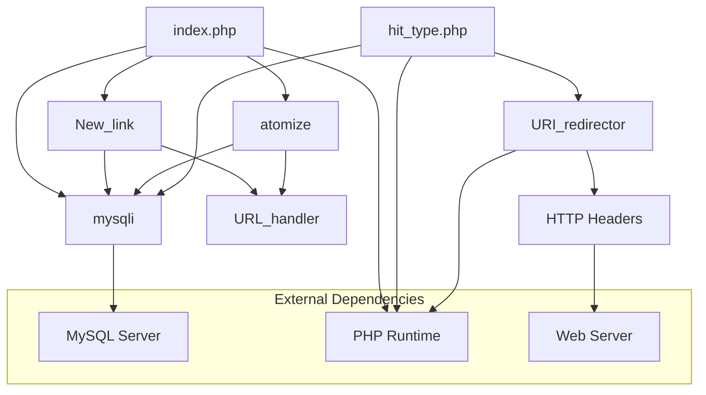

## Scalability Considerations

### Current Limitations

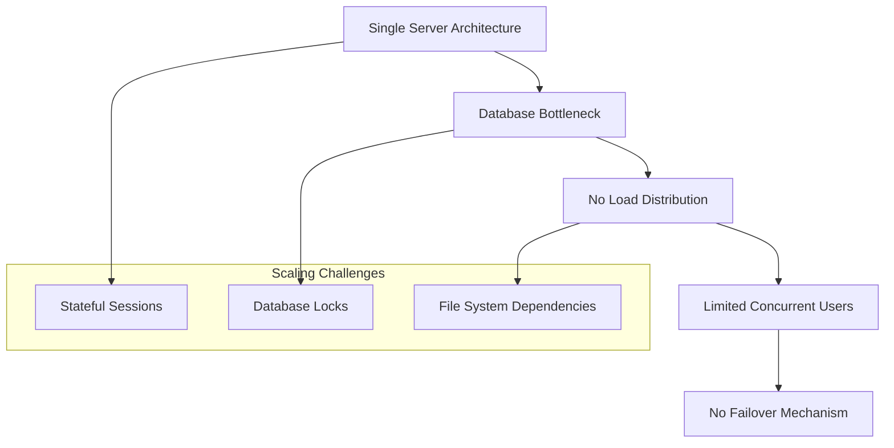

### Recommended Scaling Architecture

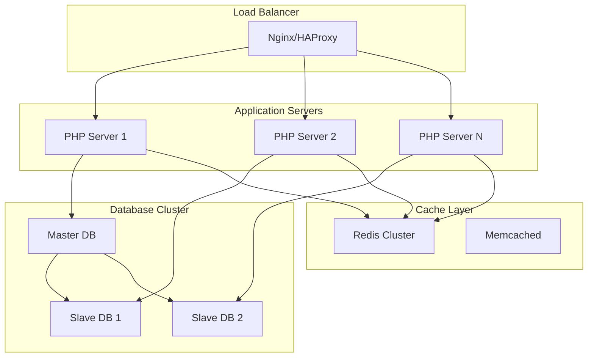

## Code Quality Metrics

### Complexity Analysis

| Component | Cyclomatic Complexity | Lines of Code | Maintainability |
|-----------|----------------------|---------------|-----------------|
| index.php | 8 | 85 | Medium |
| validator.php | 12 | 79 | Low |
| atomizer.php | 10 | 81 | Medium |
| hit_type.php | 6 | 35 | High |
| redirect.php | 3 | 16 | High |
| url_patch.php | 8 | 48 | Medium |

### Technical Debt Assessment

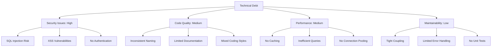

## Deployment Architecture

### Current Deployment Model

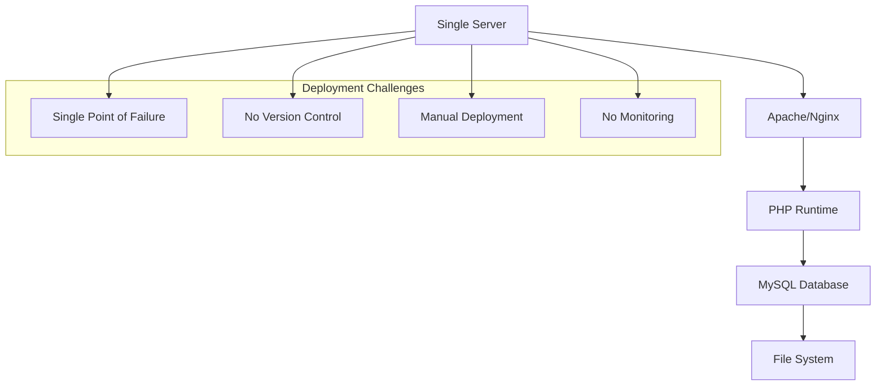

### Recommended Deployment Pipeline

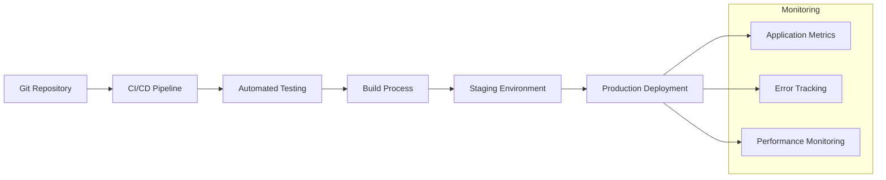

## Conclusion

This codebase represents a functional but basic URL shortener implementation. While it demonstrates core concepts effectively, it requires significant improvements in security, performance, and maintainability for production use. The modular design provides a good foundation for enhancement, but modernization efforts should focus on security hardening, performance optimization, and code quality improvements.